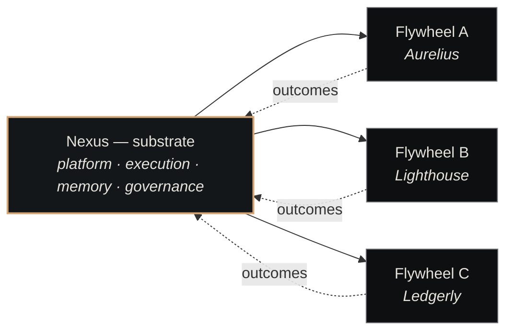
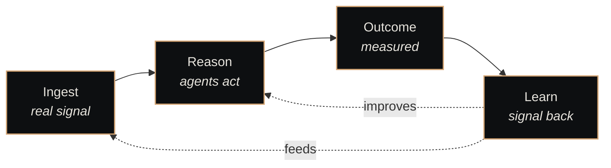
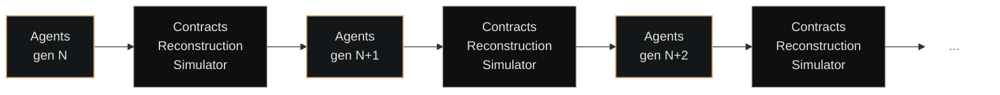

# The Flywheel

<p class="lede">Nexus is a <strong>substrate</strong> on which any number of <strong>flywheels</strong> run. Each flywheel is a self-improving agentic vertical; the substrate is the part that gets stronger every time one of them turns. This is the load-bearing thesis everything else in Nexus hangs off.</p>

<div class="page-meta">
  <span class="badge"><span class="dot"></span> living document</span>
  <span>Updated 2026-05-19</span>
  <span>Owner: Platform</span>
</div>

## The shape



The box on the left runs once. Each box on the right is a separate vertical product running on top, exchanging outcomes back so the substrate (and the next flywheel that lands on it) gets better.

## What "substrate" means here

A substrate is the part of the system that **persists across flywheels**. In Nexus, the substrate has four layers:

| Layer | Provides | Concrete |
|---|---|---|
| **Platform** | Identity, state, scoping — the canonical "what exists" | [Paperclip](../components/paperclip.md) — companies, tickets, agents, plugins |
| **Execution** | Turning intent into action — agents run here | [Nexus Core](../components/nexus-core.md) — heartbeat, dispatch, sessions |
| **Memory** | Knowledge that survives a session | [Nexus Memory](../components/nexus-memory.md) — wings, rooms, drawers, embedded search |
| **Governance** | The rules — evals, postmortems, ADRs, contracts | Plugin model + decision log + postmortem pipeline |

A flywheel that runs on Nexus doesn't bring its own ticketing, its own dispatcher, its own memory store. It uses the substrate's. That's what makes flywheels cheap to add.

## What "flywheel" means here

A flywheel is a vertical that's **closed-loop**. It looks like this:



The defining property: **every rotation makes the next rotation better**. Pipelines plateau. Flywheels compound.

A pipeline turns input X into output Y. A flywheel turns input X into output Y *and* also turns the pipeline itself into a better pipeline for the next X. The improvement signal comes from observed outcomes — not from a human re-tuning prompts every week.

## The closed loop

Three things flow back from the flywheel to the substrate after each rotation:

- **Training data** — every session's transcript, agent decisions, and tool calls are captured into [Nexus Memory](../components/nexus-memory.md). Over time this is the corpus that any next-generation agent learns from.
- **Agent improvements** — when GRPO or supervised fine-tuning produces better weights for an agent in flywheel A, those weights are checked into the [Agent Catalog](../components/agent-catalog.md) and become available to flywheel B for free.
- **Eval refinements** — gaps surfaced by postmortems land in the [Eval Registry](../components/eval-registry.md). A failure mode discovered in vertical A becomes a regression test that vertical B inherits.

This is why "the substrate gets stronger" isn't a metaphor — it's a measurable property. Eval coverage, agent skill score, memory drawer count, and ADR depth all go up monotonically across flywheel rotations.

## Why "flywheel" beats "pipeline"

The single-pipeline shape was the standard agentic architecture for two years. It looks like:

```
data → preprocess → LLM → postprocess → output
```

Three problems with it:

1. **No improvement signal** — the pipeline doesn't know whether its output was good unless a human grades it.
2. **No reuse** — a second pipeline for a different vertical shares nothing with the first.
3. **No compounding** — every improvement is a manual prompt-tweak; quality plateaus at "what the current model could do on its first attempt."

The substrate-plus-flywheels shape solves all three:

1. Outcomes are observable (tickets close, contracts settle, customers churn), so the improvement signal exists.
2. Memory, agents, and evals are shared across flywheels — vertical N reuses vertical N-1's substrate improvements.
3. Each flywheel rotation makes the *next* one start from a higher floor.

## Worked example: Aurelius

Aurelius is the first flywheel built on Nexus and the canonical example. It has three arms — a synthetic simulator, a counterparty-reconstruction pipeline, and live client contracts. The rotation is what makes it a flywheel:



One rotation: GRPO + Curriculum trains a new generation of agents on the combined corpus. The fresh weights are **deployed to the synthetic company models** in the simulator (Co A, Co B), which negotiate against the self-play engine to surface their behaviour. The **best-performing variants are promoted to production**, where they handle live client work through the Aurelius API. All three arms emit training signal — synthetic ground-truth pairs from the simulator, real-anchored pairs from reconstruction, live transcripts from production. GRPO consumes the combined pool and the cycle repeats.

The brass-edged agent nodes are the thing that compounds. The arms are the metabolism — they turn so the agents can grow.

Zoomed in, here's how a single rotation actually wires up — the three arms, the training pipeline as a fourth subsystem, and the named flows between them:


Reading the diagram:

- **Training Pipeline** (brass) is the central feedback loop — Combined Corpus → GRPO + Curriculum → Better Agents. Everything else exists to keep this pipeline fed and to receive its output.
- **Arm 1 (Production Integration)** is the live-money path — Nexus Contract talks to Aurelius API over HTTP for real client negotiations.
- **Arm 2 (Simulator)** is two synthetic companies (one aggressive, one patient) negotiating against a self-play engine. The companies use the new agent weights to play their counterparty roles; the engine is an MCP harness in front of the model under test (it updates on its own cadence). This arm is the source of ground-truth two-sided data the other arms can't produce.
- **Arm 3 (Reconstruction)** unlocks the existing S3 corpus by inferring the counterparty side via a 4-stage Bayesian inference, validated against simulator ground truth.

Each arm contributes something the others (and the next generation) need:

- **Simulator** generates ground truth (it knows both sides) — gives reconstruction something to train on.
- **Reconstruction** unlocks the real corpus (one-sided client logs) — grounds the simulator in real-world distributions.
- **Contracts** is the live deploy target — only the best-performing variants from simulator evaluation make it here, where they handle real client work and generate new transcripts that feed the next rotation.

After one full rotation, the substrate has more memory, better agents in the catalog, sharper evals, and a richer ADR set than before. The next flywheel that lands on Nexus inherits all of that.

## Maturity stages

A flywheel doesn't start compounding on day one. Realistic stages:

| Stage | What's happening | Signal |
|---|---|---|
| **0 — Arms exist** | Each arm shipped independently. Loop not closed yet. | Each arm has standalone value. |
| **1 — First rotation** | One end-to-end pass through the loop. | Agents at end of rotation measurably better than at start. |
| **2 — Routine iteration** | Rotations happen on cadence (weekly or per-contract). | Agent quality still climbing; diminishing returns curve is gentle. |
| **3 — Self-bootstrapping** | Synthetic data is most of the training pool; real corpus grounds it but is no longer the bottleneck. | New real data provides marginal improvement, not step-change. |
| **4 — Productized** | The flywheel itself is the product. Ablations are publishable. | Customers buy access to the loop, not just point-in-time output. |

Each stage takes months to years. The decision to build a flywheel rather than a pipeline is a decision to accept a quiet period of investment before the multiplicative phase.

## Failure modes

Flywheels have failure modes pipelines don't. The big four:

- **Reward hacking** — agents discover exploits in the substrate's scoring functions that don't transfer. Mitigation: real-corpus data weighted into training; hold-out evals.
- **Distributional drift** — synthetic data shifts the agent's prior away from real-world distributions. Mitigation: reconstruction or live-corpus anchoring.
- **Confidence cascade** — miscalibrated confidence on one rotation gets baked into the next. Mitigation: periodic re-calibration against held-out ground truth.
- **Feedback amplification** — a pathology in rotation N gets reinforced in N+1, locked in by N+2. Mitigation: anchor corpus that never drifts; postmortem any sudden eval shift.

The substrate gives you the observability to spot these (every transition is logged, every outcome is queryable). It doesn't prevent them — that's a flywheel-design concern.

## See also

- [Substrate vs. flywheels](substrate-vs-flywheels.md) — positioning vs. point-solution stacks
- [Platform Layer](platform-layer.md) — what tracks state
- [Execution Layer](execution-layer.md) — what runs the agents
- [Memory Layer](memory-layer.md) — what persists between rotations
- [Governance](governance.md) — evals, postmortems, ADRs
