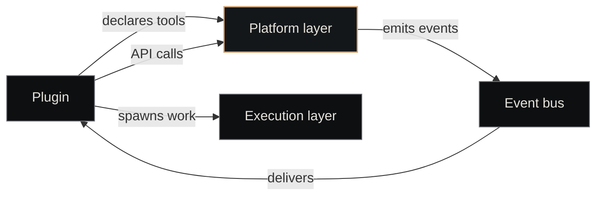

# Platform Layer

The platform layer is Nexus's <strong>canonical record of what exists</strong>. Companies, tickets, agents, plugins, contracts — every persistent entity has its identity, state, and scope tracked here. If two parts of the system disagree about reality, the platform layer wins.

   living document
  Updated 2026-05-19
  Owner: Platform

## What it tracks

The platform layer holds the answers to "what is there?" questions. Every entity it tracks has:

- A **stable identity** (UUID) that doesn't change as the entity evolves
- A **state** that progresses through a documented lifecycle
- An **owner** (a company) that scopes its visibility and modification rights
- An **audit trail** of state transitions

The current entity set:

| Entity | What it represents | Lifecycle owner |
|---|---|---|
| **Company** | A unit of work scope (domain or craft) | Holdings / parent company |
| **Ticket** | A single piece of work with an acceptance criterion | Its company |
| **Agent** | A configured worker (prompt + tools + model) | Agent catalog (config); Paperclip (runtime) |
| **Plugin** | A typed extension to the platform (workers + tools) | Plugin manifest |
| **Routine** | A scheduled recurring task | Its company |
| **Contract** | A formal agreement between two companies | The pair of companies |
| **Session** | One agent invocation, observed end-to-end | Execution layer; platform layer holds the pointer |

The platform layer doesn't *interpret* these entities — it doesn't decide what a ticket means, only that it exists with these fields in this state. Interpretation lives in the higher layers.

## The shape

The other layers depend on the platform layer for identity and state. The platform layer depends on no other layer — that's what makes it the source of truth.

## Single source of truth

Nexus has one principle the platform layer enforces above all others:

> **An entity's state is what the platform layer says it is.** Not what an agent thinks it is. Not what a stale cache thinks it is. Not what a webhook claimed.

Every other layer treats platform state as authoritative. Practical consequences:

- The execution layer **claims** a ticket via platform API before starting work — concurrent dispatches can't both claim the same ticket.
- Memory drawers carry platform IDs (`company_id`, `ticket_id`) so a drawer's scope is verifiable against current state.
- The merge agent verifies ticket state *via the platform API* immediately before merging, never trusting an in-memory snapshot.

When the platform layer disagrees with itself (two clients see different states), that's a high-severity bug, not a "we'll reconcile later" situation. The whole substrate composes only because this layer is consistent.

## What it does not do

The platform layer **does not**:

- **Run agents** — that's the [execution layer](execution-layer.md). The platform layer hands out tickets; something else picks them up and dispatches.
- **Store knowledge** — that's the [memory layer](memory-layer.md). The platform layer tracks pointers to sessions and drawers, not their contents.
- **Decide policy** — that's [governance](governance.md). Whether ticket X is appropriate for agent Y is an evals/skill-flag question, not a platform question.
- **Reason about correctness** — the platform layer doesn't know whether a code change is good, only that the ticket transitioned `in_review → done`.

This separation keeps the platform layer small. It's a state machine plus a record store, not an application.

## The plugin model

Plugins are how the platform layer is extended without growing its core. Each plugin:

1. Registers with the platform on startup (declares its workers and tools)
2. Listens for platform events (`ticket.created`, `session.exited`, etc.)
3. Calls platform APIs to make changes (create a ticket, post a comment, transition state)

This is what lets the platform layer be *generic* (companies, tickets, agents — primitives) while specific behaviors (ACP session management, contracts, craft dispatch, memory bridging) live in pluggable extensions.

See [Plugins](../components/plugins/index.md) for the canonical plugin model and DFA 23 in `state-machines.md` for the lifecycle state machine.

## The HTTP and webhook surface

The platform layer is reached by other layers (and external callers) through two surfaces:

- **HTTP API** — synchronous CRUD over the entity set. Used by humans, agents, and webhooks. Documented in [API — Paperclip](../reference/api-paperclip.md).
- **Event bus** — asynchronous, fan-out push of state transitions. Used by plugins and other layers to react without polling.

The HTTP API is consistent (writes are durable before responding). The event bus is best-effort with at-least-once delivery; consumers must be idempotent.

## Why a single platform layer

A common alternative architecture is "every service owns its own state." That's the wrong shape for an agentic substrate, for one specific reason:

> **Agents are bad at reconciling distributed state.**

A human engineer can read three dashboards and judge which one is current. An agent given three contradictory readings will pick one essentially at random — and then act on it. The substrate's whole job is to be *legible* to agents. That means one canonical place to ask "what is the state of ticket X?" and get a deterministic answer.

The cost is that the platform layer has to be high-availability and well-engineered. The benefit is that everything above it gets to be simple.

## Implementation

The platform layer is implemented by [Paperclip](../components/paperclip.md) — a TypeScript HTTP server with an embedded Postgres store, exposing CRUD on the entity set and a webhook/event surface for plugins.

Other implementations are possible (the layer is a contract, not a vendor lock-in), but Paperclip is what Nexus ships with and what every flywheel currently runs against.

## See also

- [Paperclip](../components/paperclip.md) — the implementation
- [Plugins overview](../components/plugins/index.md) — how the layer is extended
- [Tickets](../concepts/tickets.md) — the most-touched entity
- [Companies](../concepts/companies.md) — the unit of scope
- [API — Paperclip](../reference/api-paperclip.md) — the HTTP surface
- [Execution Layer](execution-layer.md) — the layer above
