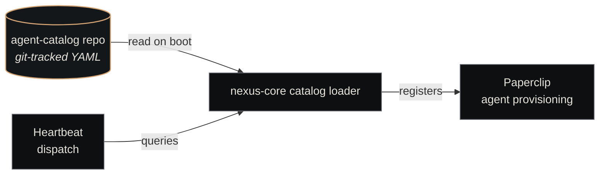

# Agent Catalog

<p class="lede">The Agent Catalog is the canonical registry of agent definitions for the substrate. Every agent that the dispatcher can spawn — frontend engineer, code reviewer, security auditor, postmortem-writer — has a versioned YAML entry here. The catalog is the boundary between "which agents exist" (declarative) and "spawning the right one for this ticket" (runtime decision).</p>

<div class="page-meta">
  <span class="badge"><span class="dot"></span> living document</span>
  <span>Updated 2026-05-19</span>
  <span>Owner: Platform</span>
</div>

## What it is

A git-tracked directory of YAML files, one per agent type. [Nexus Core](nexus-core.md) loads the catalog at startup, matches agents to incoming tickets by skill, and provisions sessions via [Paperclip](paperclip.md).

| Property | Value |
|---|---|
| **Path** | `~/Projects/nexus/agent-catalog/` |
| **Format** | YAML (one file per agent at `agents/<id>.yaml`) |
| **Loader** | `nexus/agents/catalog.py` in [Nexus Core](nexus-core.md) |
| **Env var** | `NEXUS_AGENT_CATALOG_PATH` (defaults to repo path) |
| **Size** | 45 agent definitions (37 categorised across 12 categories; 8 uncategorised role-named YAMLs) |

## The schema

Every agent YAML follows the same shape:

```yaml
# agents/backend-code-writer.yaml
id: backend-code-writer              # globally unique, kebab-case
version: "1.0.0"                     # semver, see versioning rules below
category: backend-dev                # one of: backend-dev, frontend-dev,
                                     # design, devops, security, review,
                                     # intake, ticket-creation, improvement,
                                     # research, leadership, management

base_prompt: |                       # role description used as system prompt
  You are a senior backend engineer working on Nexus services.
  Prioritize correctness, test coverage, and observability.

skills:                              # capability tags for dispatch matching
  - nodejs
  - python
  - postgresql
  - rest-apis

tools:                               # MCP tools this agent may invoke
  - github-mcp
  - claude-code

model_config:                        # which model tier + escalation rules
  default: sonnet
  complex_tasks: opus
  simple_tasks: haiku

team_eligible: true                  # whether this agent can be composed into
                                     # a team (per agent-catalog/teams/*.md).
                                     # Every on-disk YAML sets this explicitly.

performance:                         # populated by metrics (currently empty;
  metrics: {}                        # the self-improvement company is wiring
  by_scenario: {}                    # the feedback loop)
  by_model: {}

changelog:                           # one entry per version bump
  - version: "1.0.0"
    change: "Initial catalog entry"
    justification: "Bootstrap"
```

## Categories

Agents are grouped into twelve categories for skill-matching and UI display. Counts are as of 2026-05-19:

| Category | Count | Examples | When used |
|---|---|---|---|
| **intake** | 6 | intake-explicit, intake-implicit, intake-source-reader | First-touch on new requests |
| **review** | 4 | review-aggregator, review-consistency-checker, review-gap-detector, review-docs-auditor | Adjacent to the merge agent |
| **ticket-creation** | 4 | ticket-criteria-agent, ticket-dependency-agent, ticket-epic-writer, ticket-story-writer | Bootstrap new initiatives |
| **backend-dev** | 3 | backend-code-writer, backend-code-tester, backend-acceptance-validator | Server-side / data work |
| **frontend-dev** | 3 | frontend-component-builder, frontend-ui-designer, frontend-acceptance-validator | UI / web work |
| **devops** | 3 | devops-pipeline-writer, devops-infra-reviewer, devops-deployment-validator | Deploy, monitor, alert |
| **security** | 3 | security-code-auditor, security-threat-modeller, security-compliance-checker | Pen test, audit, secret rotation |
| **improvement** | 3 | improvement-feedback-analyst, improvement-risk-assessor, improvement-writer | Cleanup / hardening |
| **design** | 2 | design-architect, design-ux-planner | Mockups, user research |
| **research** | 2 | autoresearch-evaluator, autoresearch-mutator | Training-data + eval generation |
| **leadership** | 2 | company-lead, tech-lead | C-suite & cross-company coordination |
| **management** | 2 | pm-classifier, retro-analyst | Within-company coordination |

That's 37 categorised agents. Another 8 YAMLs sit at the top level without a `category:` field — these are role-named entries (`backend-engineer`, `devops-engineer`, `frontend-engineer`, `fullstack-engineer`, `product-manager`, `qa-engineer`, `security-engineer`, `technical-writer`). Total catalog: **45 agent definitions**. The full set lives in `agent-catalog/agents/` — new agents go in via PR.

## Versioning rules

Semantic versioning, with PR review gates on every bump:

| Bump | What it signals | Example |
|---|---|---|
| **Patch** (`x.y.Z`) | Prompt fix, no skill or tool change | "Tighten scope discipline" |
| **Minor** (`x.Y.0`) | Additive — new skill, new tool, expanded prompt | "Added postgres skill" |
| **Major** (`X.0.0`) | Breaking — removed skill/tool, incompatible prompt rewrite | "Replaced cli-first with api-first orientation" |

Why this matters: agent performance is tracked per version in the metrics DB. If a `2.3.0` agent regresses against `2.2.x`, the data shows it — and the next iteration can roll back or adjust.

## How dispatch uses the catalog

The [heartbeat](../concepts/heartbeat.md) reads tickets from [Paperclip](paperclip.md), then for each:

1. **Match by skill** — the ticket's labels + acceptance criteria are turned into required skills
2. **Filter by company roster** — only agents allowed in this company are candidates
3. **Score and pick** — recent success rate, model availability, current load, all factor in
4. **Provision** — the chosen agent's `base_prompt` + tools + model are passed to the [ACP plugin](plugins/acp.md) which spawns the session

This means an agent only "exists" for a ticket if it's in the catalog AND in the company's roster. A new agent file in the catalog isn't enough — companies have to opt in.

## Teams

Some work needs multiple agents collaborating. The `teams/` directory defines team compositions as Markdown runbooks (one `.md` per team — `backend-dev.md`, `review.md`, `devops.md`, `frontend-dev.md`, `design.md`, `intake.md`, `improvement.md`, `retro.md`, `security-review.md`, `ticket-creation.md`):

```markdown
# Review Team
version: 1.3.0
last_updated: 2026-04-03
category: review

## Purpose
Four specialist agents run in parallel — Review Aggregator (lead),
Consistency Checker, Gap Detector, Docs Auditor — and all four must
pass before a PR approval verdict is issued.

## Composition
| Role | Agent Type | Model Tier |
|------|-----------|------------|
| Review Aggregator (Lead) | review-aggregator | Haiku |
| Consistency Checker | review-consistency-checker | Sonnet |
| Gap Detector | review-gap-detector | Sonnet |
| Docs Auditor | review-docs-auditor | Sonnet |

## Team Lead
Review Aggregator — spawns all four agents concurrently, collects
findings, issues the final verdict.
```

Teams are referenced by ticket labels (e.g., `team:review`) — dispatch then provisions the whole team for that ticket.

## Where it lives in the substrate



The catalog is **read-mostly at runtime**. Changes happen via git PRs, not via the API. This keeps the catalog reviewable and auditable.

## See also

- [Nexus Core](nexus-core.md) — the loader and dispatch logic
- [Paperclip](paperclip.md) — where provisioned agents are registered
- [Heartbeat](../concepts/heartbeat.md) — the dispatch loop that uses the catalog
- [ACP plugin](plugins/acp.md) — how agent definitions become running sessions
- [Eval Registry](eval-registry.md) — what scores agent performance
- [Create an Agent](../guides/create-an-agent.md) — operational walkthrough
