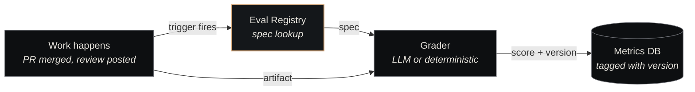

# Eval Registry

<p class="lede">The Eval Registry is where Nexus defines <strong>how work is scored</strong>. Every eval — code-quality, security-scan, design-adherence, review-efficiency, run-quality — has a versioned YAML spec and a human-readable rubric here. The registry is the canonical answer to "is this piece of work good?"</p>

<div class="page-meta">
  <span class="badge"><span class="dot"></span> living document</span>
  <span>Updated 2026-05-19</span>
  <span>Owner: Platform</span>
</div>

## What it is

A git-tracked directory of YAML specifications and Markdown rubrics, structured one folder per eval type. The [governance layer](../architecture/governance.md) reads the registry whenever it needs to score work; every recorded score is tagged with the eval version that produced it.

| Property | Value |
|---|---|
| **Path** | `~/Projects/nexus/eval-registry/` |
| **Specs** | `specs/<eval-type>/<version>.yaml` |
| **Rubrics** | `rubrics/<eval-type>.md` |
| **Analysis** | `analysis/` — comparability matrices, migration notes |
| **Eval types** | 5 currently (see below) |

## The five eval types

| Eval | Scores | Trigger |
|---|---|---|
| **code-quality** | Test coverage, lint passes, type-check, complexity, naming | Every PR merge |
| **security-scan** | Secret presence, dependency CVEs, dangerous-pattern matches | Every PR merge + nightly sweep |
| **design-adherence** | Design-token usage, accessibility compliance, layout consistency | UI-touching tickets |
| **review-efficiency** | Time-to-verdict, verdict-vs-eval agreement, escalation rate | Every review verdict posted |
| **run-quality** | End-to-end session quality — adherence to AC, transcript hygiene, agent behaviour signals | Every completed agent session |

More types are added as new failure modes get postmortems. The catalog grows monotonically — old eval versions stay around because old scores reference them.

## The spec format

The currently-shipped rubric is `run-quality` — the only one with both a `specs/<eval>/v1.0.0.yaml` and a `rubrics/<eval>.md` on disk. The other four eval types listed above have specs scaffolded but rubrics still in progress; the run-quality pair is the canonical exemplar of the format.

```yaml
# specs/run-quality/v1.0.0.yaml
id: run-quality
version: "1.0.0"
description: >
  Scores the quality of a full agent run — dispatch through execution to flow-back.

scoring:
  method: weighted_sum
  range: [0.0, 1.0]
  passing_threshold: 0.70

dimensions:
  task_completion:
    weight: 0.30
    description: Did the agent complete the ticket as specified?
    score_guide:
      1.0:  "All acceptance criteria met; clean flow-back to done"
      0.75: "All criteria met with minor deviations; flow-back worked"
      0.5:  "Partial completion — some criteria met, others missed"
      0.25: "Minimal progress; blocked or cancelled with partial work"
      0.0:  "No meaningful progress; agent failed to start or looped"
    observables:
      - "Dispatched ticket final status (done/cancelled/blocked)"
      - "Acceptance criteria checklist in ticket comments"
      - "Git commits on feature branch"

  code_evals:        { weight: 0.15, ... }
  spec_quality:      { weight: 0.15, ... }
  memory_utilization:{ weight: 0.15, ... }
  token_efficiency:  { weight: 0.15, ... }
  autonomy:          { weight: 0.10, ... }
```

Every eval type ships its initial spec at `specs/<eval-type>/v1.0.0.yaml` plus a `changelog.md` next to it. Migration notes for future major bumps will land in `analysis/`.

The matching rubric (`rubrics/run-quality.md`) provides the human-readable scoring criteria — the prompt fed to the LLM grader, the observable signals for each dimension, the question to ask when scoring borderline cases.

## Versioning rules (PR-gated)

Changes to evals are stricter than agents or routines because scores have to remain comparable over time. Every change requires:

- **Patch** (`x.y.Z`) — clarifying language in the rubric, no scoring change. Run the old corpus through the new spec — scores must match.
- **Minor** (`x.Y.0`) — additive (new component with weight 0). KPI evidence in changelog: average score moves by < 0.05 on the existing corpus.
- **Major** (`X.0.0`) — breaking (weight changes, threshold changes, aggregation change). KPI evidence required; old scores are NOT re-graded with the new version — they stay tagged with their original version.

The PR template enforces this. A reviewer cannot approve a minor or major bump without evidence in the changelog.

## How evals get applied



The metrics DB records `(eval_id, eval_version, score, evidence, timestamp)` for every grading event. Querying performance over time always joins on version — a regression analysis that ignored versioning would conflate "the agent got worse" with "the eval got stricter."

## Comparability across versions

The `analysis/` directory is where migration notes will land whenever a major version of any eval ships. At the moment it holds only `comparability-matrix.yaml` (a global pairwise version-compatibility table) and a `migration-notes/` subdirectory; no per-eval `analysis/<eval>-vN-to-vM.md` files exist yet because every shipped eval is still on `v1.0.0`.

When the first major bump happens, the analysis file should capture:

- **Score shift on existing corpus** — median + pass-rate before and after, re-graded against a held-out subset
- **What changed** — the concrete weights/thresholds/components that moved, with the postmortem or ADR that motivated each
- **Mapping for trend analysis** — a calibration factor (or per-bucket mapping) so dashboards spanning the cutover can still compare scores

This is what lets the substrate compare "agent performance over a year" even when evals have shifted underneath.

## Where it fits

The Eval Registry is the canonical "scoring rubric" surface for the [governance layer](../architecture/governance.md). Postmortems reference it ("this failure was not covered by any existing eval — propose a new component"). New agents are tested against it. Old agents are continuously measured against it.

It's the thing that turns "did this PR look good?" from a judgment call into a recorded data point.

## See also

- [Governance](../architecture/governance.md) — the architecture page this component implements
- [Postmortems](../concepts/postmortems.md) — what surfaces eval gaps
- [Agent Catalog](agent-catalog.md) — what evals score
- [Decisions Index](../concepts/decisions-index.md) — where eval changes are sometimes ADR'd
