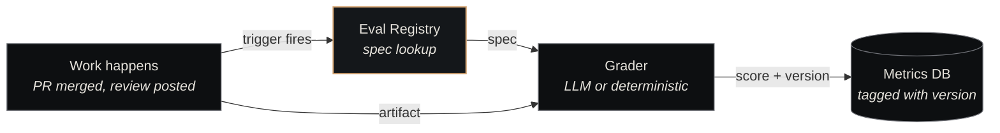

# Eval Registry

<p class="lede">The Eval Registry is where Nexus defines <strong>how work is scored</strong>. Every eval — code-quality, security-scan, design-adherence, review-efficiency, run-quality — has a versioned YAML spec and a human-readable rubric here. The registry is the canonical answer to "is this piece of work good?"</p>

<div class="page-meta">
  <span class="badge"><span class="dot"></span> living document</span>
  <span>Updated 2026-05-19</span>
  <span>Owner: Platform</span>
</div>

## What it is

A git-tracked directory of YAML specifications and Markdown rubrics, structured one folder per eval type. The [governance layer](../architecture/governance.md) reads the registry whenever it needs to score work; every recorded score is tagged with the eval version that produced it.

| Property | Value |
|---|---|
| **Path** | `~/Projects/nexus/eval-registry/` |
| **Specs** | `specs/<eval-type>/<version>.yaml` |
| **Rubrics** | `rubrics/<eval-type>.md` |
| **Analysis** | `analysis/` — comparability matrices, migration notes |
| **Eval types** | 5 currently (see below) |

## The five eval types

| Eval | Scores | Trigger |
|---|---|---|
| **code-quality** | Test coverage, lint passes, type-check, complexity, naming | Every PR merge |
| **security-scan** | Secret presence, dependency CVEs, dangerous-pattern matches | Every PR merge + nightly sweep |
| **design-adherence** | Design-token usage, accessibility compliance, layout consistency | UI-touching tickets |
| **review-efficiency** | Time-to-verdict, verdict-vs-eval agreement, escalation rate | Every review verdict posted |
| **run-quality** | End-to-end session quality — adherence to AC, transcript hygiene, agent behaviour signals | Every completed agent session |

More types are added as new failure modes get postmortems. The catalog grows monotonically — old eval versions stay around because old scores reference them.

## The spec format

```yaml
# specs/code-quality/v1.0.0.yaml
id: code-quality
version: 1.0.0

target:                              # what this eval applies to
  kind: pull-request
  filter:
    languages: [python, typescript, go]
    excludes: ["**/test_*", "**/*.md"]

scoring:                             # how scores are computed
  type: weighted-rubric              # one of: weighted-rubric | llm-graded | deterministic
  components:
    - name: test_coverage
      weight: 0.3
      threshold: 0.7                  # below this, partial credit
    - name: type_check_passes
      weight: 0.2
      type: boolean
    - name: lint_passes
      weight: 0.2
      type: boolean
    - name: cyclomatic_complexity
      weight: 0.15
      threshold_max: 10               # avg per function
    - name: naming_quality
      weight: 0.15
      type: llm-graded
      grader_prompt_ref: rubrics/code-quality.md#naming

aggregation:
  method: weighted-sum                # one of: weighted-sum | min | strict-all
  pass_threshold: 0.75

changelog:
  - "1.0.0: initial spec — weighted-sum aggregation, naming_quality LLM-graded"
```

(Every eval type ships its initial spec at `specs/<eval-type>/v1.0.0.yaml`. Migration notes for future major bumps will land in `analysis/`.)

The rubric (`rubrics/code-quality.md`) provides the human-readable scoring criteria — the prompt fed to the LLM grader, the test command for boolean components, examples of "naming quality" for each level.

## Versioning rules (PR-gated)

Changes to evals are stricter than agents or routines because scores have to remain comparable over time. Every change requires:

- **Patch** (`x.y.Z`) — clarifying language in the rubric, no scoring change. Run the old corpus through the new spec — scores must match.
- **Minor** (`x.Y.0`) — additive (new component with weight 0). KPI evidence in changelog: average score moves by < 0.05 on the existing corpus.
- **Major** (`X.0.0`) — breaking (weight changes, threshold changes, aggregation change). KPI evidence required; old scores are NOT re-graded with the new version — they stay tagged with their original version.

The PR template enforces this. A reviewer cannot approve a minor or major bump without evidence in the changelog.

## How evals get applied



The metrics DB records `(eval_id, eval_version, score, evidence, timestamp)` for every grading event. Querying performance over time always joins on version — a regression analysis that ignored versioning would conflate "the agent got worse" with "the eval got stricter."

## Comparability across versions

The `analysis/` directory holds migration notes whenever a major version ships. Example:

```markdown
# analysis/code-quality-v3-to-v4.md

## Score shift on existing corpus
Re-ran v4.0 against the 2026-Q1 PR corpus:
- Median: 0.78 (v3) → 0.71 (v4)
- Pass rate (>=0.75): 64% (v3) → 51% (v4)

## What changed
- weighted-sum replaces strict-all (was failing too many on single missing
  component)
- naming_quality added as LLM-graded (new dimension)

## Mapping for trend analysis
For dashboards spanning the cutover (2026-04-12), use:
  score_normalized = score_v4 * 1.10  (calibrated against shared subset)
```

This is what lets the substrate compare "agent performance over a year" even when evals have shifted underneath.

## Where it fits

The Eval Registry is the canonical "scoring rubric" surface for the [governance layer](../architecture/governance.md). Postmortems reference it ("this failure was not covered by any existing eval — propose a new component"). New agents are tested against it. Old agents are continuously measured against it.

It's the thing that turns "did this PR look good?" from a judgment call into a recorded data point.

## See also

- [Governance](../architecture/governance.md) — the architecture page this component implements
- [Postmortems](../concepts/postmortems.md) — what surfaces eval gaps
- [Agent Catalog](agent-catalog.md) — what evals score
- [Decisions Index](../concepts/decisions-index.md) — where eval changes are sometimes ADR'd
