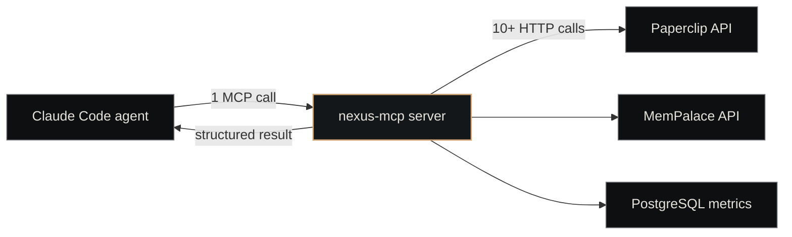

# Nexus MCP

<p class="lede">Nexus MCP is the <strong>chairman-level MCP server</strong>: 12 compound tools that bundle multi-step platform operations behind single invocations. It's what a Claude Code session calls when it wants to know "what's the state of every company right now?" without firing twenty individual API requests.</p>

<div class="page-meta">
  <span class="badge"><span class="dot"></span> living document</span>
  <span>Updated 2026-05-19</span>
  <span>Owner: Platform</span>
</div>

## What it is

A Python MCP server that wraps Nexus's other components (Paperclip, MemPalace, the metrics DB) into higher-level "audit / inspect / dispatch / store-decision" operations. Each tool bundles 10+ underlying API calls into one structured result.

| Property | Value |
|---|---|
| **Path** | `~/Projects/nexus/nexus-mcp/` |
| **Language** | Python 3.11+ (uv-managed) |
| **Entry point** | `nexus_mcp/server.py` |
| **Install** | `claude mcp add nexus -- ~/Projects/nexus/nexus-mcp/.venv/bin/python -m nexus_mcp.server` |
| **Tool count** | 12 (as of 2026-05-19) |

## Design philosophy: compound tools, not thin wrappers

This is the rule that shapes everything in the server:

> MCP tools should be **compound runbooks** — each tool executes multiple API/tool/CLI calls behind the scenes and returns a structured result. Wasteful to use an MCP server as a thin wrapper around single CLI commands that could be called directly.

Why: token efficiency. A single `nexus_status` tool call replaces ~12 individual API fetches, condensing them into one result the agent can scan in a single prompt cycle. The compound operations also enforce a consistent shape — agents don't have to remember which combination of Paperclip queries adds up to "all stuck work."

## The 12 tools

| Tool | Purpose | Side effects |
|---|---|---|
| `nexus_status` | Full platform audit — companies, issues, agents, plugins, infrastructure, metrics summary | None |
| `company_deep_dive` | Single-company overview — issues, agents, projects, routines, recent activity | None |
| `create_issue` | File a new ticket against a company | Creates ticket in Paperclip |
| `find_stuck_work` | Detect bottlenecks — issues stuck in_progress / in_review beyond a threshold | None |
| `find_template_drift` | Byte-for-byte parity check between `company-template` and reference workflows | None |
| `find_unmerged_done` | Detect merge drift — tickets marked `done` whose branch is not on `origin/main` | None |
| `dispatch_work` | Manually trigger a heartbeat tick for a company | Spawns agent session |
| `search_knowledge` | Unified knowledge search across MemPalace + Context-1 | None |
| `store_decision` | Record a decision (ADR-like) into the memory layer | Writes drawer |
| `performance_report` | Aggregated metrics — performance records from PostgreSQL | None |
| `trigger_routine` | Manually trigger a routine by name across all companies | Runs routine |
| `manage_company` | Company lifecycle — archive, activate, list archived | Updates Paperclip |

Roughly half are read-only audit tools; the other half mutate state (create issues, dispatch work, store decisions, trigger routines, archive companies).

## How it fits



The agent never has to know about the underlying services — it sees a tool surface scoped at the *operational task* level, not the *API endpoint* level.

## When to use which tool

- **Just opened a session and need context?** → `nexus_status`
- **About to act on a specific company?** → `company_deep_dive`
- **Hunting a bottleneck?** → `find_stuck_work` + `find_unmerged_done`
- **Need to act, not just inspect?** → `create_issue`, `dispatch_work`, `trigger_routine`
- **Capturing a decision?** → `store_decision`
- **Reviewing metrics?** → `performance_report`

The [`nexus-status` skill](skills-catalog.md) wraps `nexus_status` with a standard "health check" interaction; the [`nexus-tickets` skill](skills-catalog.md) wraps `create_issue` + related ticket tools. Skills compose tools.

## Setup

Requires Python 3.11+ and [uv](https://docs.astral.sh/uv/):

```bash
cd ~/Projects/nexus/nexus-mcp
uv venv && uv pip install -e ".[dev]"

# Register with Claude Code (one-time per host)
claude mcp add nexus -- \
  ~/Projects/nexus/nexus-mcp/.venv/bin/python -m nexus_mcp.server

# Verify
claude mcp list                  # nexus should appear with 12 tools
```

The server is spawned by Claude Code when a session starts that has Nexus MCP enabled — there's no standing daemon. Sessions without need for chairman-level operations don't pay the spawn cost.

## Configuration

The MCP server reads from the same environment as the other Python components:

```bash
# Paperclip endpoint
PAPERCLIPAI_URL=http://127.0.0.1:3100

# MemPalace REST endpoint
NEXUS_MEMORY_URL=http://127.0.0.1:8102

# Metrics DB (for performance_report)
NEXUS_METRICS_DB=postgresql://localhost/nexus_metrics
```

Defaults are loopback localhost addresses with standard ports — usually no override needed.

## When to extend it

Add a new tool when you find yourself calling 3+ existing tools in a stereotyped pattern. Don't add a tool that wraps a single API call — that's the "thin wrapper" anti-pattern. The bar is *compound operation that recurs*.

PR-gated: new tools need a test that validates the structured-result shape, and a clear "why one call instead of N" justification in the PR description.

## See also

- [Paperclip](paperclip.md) — primary underlying API
- [Nexus Memory](nexus-memory.md) — what `search_knowledge` and `store_decision` talk to
- [Skills Catalog](skills-catalog.md) — workflow skills that compose these tools
- [Agent Catalog](agent-catalog.md) — agents that get these tools registered at dispatch
- [Heartbeat](../concepts/heartbeat.md) — what `dispatch_work` triggers
