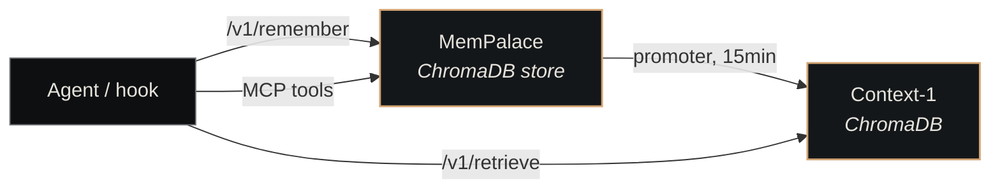

# Nexus Memory

<p class="lede">Nexus Memory is the concrete implementation of the <a href="../../architecture/memory-layer/">memory layer</a> — a FastAPI sidecar bundling MemPalace (the write-side JSON store), Context-1 (the read-side ChromaDB vector store), the promoter that bridges them, and MCP servers exposing 25+ memory tools to agents.</p>

<div class="page-meta">
  <span class="badge"><span class="dot"></span> living document</span>
  <span>Updated 2026-05-19</span>
  <span>Owner: Platform</span>
</div>

## What it is

A Python 3.11+ package with three runtime processes (REST API, ChromaDB, MCP servers) and one scheduled job (promoter). Everything binds to localhost — no remote callers, no auth.

| Property | Value |
|---|---|
| **Path** | `~/Projects/nexus/nexus-memory/` |
| **REST API** | `http://127.0.0.1:8102/v1/...` (FastAPI, `api/server.py`) |
| **ChromaDB** | `http://127.0.0.1:8101/` (vector store) |
| **Promoter** | `mempalace-promoter.timer` (15-min cadence) |
| **MCP servers** | Context-1 (3 tools) + MemPalace (25 tools) |
| **Embedder** | bge-m3 on GPU (CUDA), CPU fallback |

## Subsystems



- **MemPalace** is the write-side store at `~/.mempalace/palace/` (ChromaDB SQLite + HNSW segment dir). Content-addressed: writing the same content twice is a no-op.
- **Context-1** lives in `context1/`. Uses ChromaDB collections (one per wing). Embeddings computed by bge-m3.
- **The promoter** lives in `scripts/promoter.py`. Reads MemPalace's manifest, embeds drawers not yet in Context-1, upserts to ChromaDB.

The [Memory Layer](../architecture/memory-layer.md) architecture page explains the two-store rationale.

## REST API

The FastAPI surface exposes these endpoints on `:8102/v1/`:

| Endpoint | Method | Purpose |
|---|---|---|
| `/v1/remember` | POST | Write a drawer to MemPalace |
| `/v1/retrieve` | POST | Semantic retrieval against Context-1 |
| `/v1/search` | POST | Keyword/lexical search against MemPalace |
| `/v1/reindex` | POST | Re-index a directory into a ChromaDB collection |
| `/v1/wake-up` | GET | Pre-load embedder + warm caches |
| `/v1/status` | GET | Health + counts per wing |
| `/health` | GET | Liveness probe |

Full surface at [API — MemPalace](../reference/api-mempalace.md).

## MCP servers

Agents reach memory via MCP tools. Two servers run side-by-side:

**Context-1 MCP** — 3 tools, focused on retrieval (`context1/mcp_server.py`):
- `retrieve` — semantic query across collections
- `search_collection` — query a single named collection
- `list_collections` — enumerate available collections

**MemPalace MCP** — 25 tools, broader surface (`mempalace.mcp_server`):
- `mempalace_add_drawer`, `mempalace_search`, `mempalace_diary_write` — read/write essentials
- `mempalace_kg_query`, `mempalace_kg_add`, `mempalace_kg_invalidate`, `mempalace_kg_timeline`, `mempalace_kg_stats` — knowledge-graph operations
- `mempalace_traverse`, `mempalace_find_tunnels`, `mempalace_graph_stats` — palace-graph navigation
- `mempalace_status`, `mempalace_reconnect`, `mempalace_get_aaak_spec` — administrative
- the remaining tools cover drawer CRUD, wings/rooms enumeration, taxonomy lookups, duplicate-checks, diary read, hook settings, and "memories filed away" status

The MCP tools are exposed through [`paperclip-plugin-memory`](plugins/memory.md) so any Claude Code agent dispatched via Paperclip has them available.

## The promoter

The promoter is a Python script that runs every 15 minutes (via `mempalace-promoter.timer`). It does one job: take any MemPalace drawers not yet in Context-1, embed them, and upsert them to the vector store.

```python
# scripts/promoter.py - the canonical sync loop.
def promote_one_wing(wing: str) -> int:
    mp_drawers = mempalace.list_drawers(wing=wing)     # source of truth
    c1_ids     = context1.list_ids(wing=wing)          # already mirrored
    pending    = [d for d in mp_drawers if d.id not in c1_ids]

    for drawer in pending:
        vector = bge_m3.embed(drawer.content)          # GPU work
        context1.upsert(drawer.id, vector, drawer.metadata)

    return len(pending)
```

Important properties:

- **PID-lockfile guarded** at `/tmp/promoter-<wing>.lock` to prevent concurrent runs (the Stop hook fires every assistant turn and could trigger overlapping promoters otherwise)
- **GPU-resident** — bge-m3 loads to CUDA on first call (~5s warm-up), then ~30ms per drawer
- **Incremental** — only newly-arrived drawers are processed; full backfill is a one-time cost
- **Idempotent** — re-running over a synced state is a no-op

## Storage

| Store | Location | Format |
|---|---|---|
| MemPalace drawers (vectors + metadata) | `~/.mempalace/palace/chroma.sqlite3` + per-collection HNSW segment dir | ChromaDB persistent client |
| MemPalace knowledge graph | `~/.mempalace/knowledge_graph.sqlite3` | SQLite |
| Context-1 vectors | `~/Projects/nexus/nexus-memory/data/chromadb/` | ChromaDB persistent storage |
| Promoter cache | `/tmp/promoter-state.json` | last-run timestamps per wing |

Backups: cold snapshots (`scripts/cold_snapshot.sh`) tar the entire data dir; hot snapshots (`scripts/hot_snapshot.py`) capture just SQLite manifests for fast restore.

## Configuration

```bash
# Where MemPalace stores drawers on disk
MEMPALACE_PATH=~/.mempalace/palace

# ChromaDB endpoint (Context-1's vector store)
CHROMA_HOST=127.0.0.1
CHROMA_PORT=8101

# FastAPI bind port (server binds to 127.0.0.1 unconditionally)
MEMORY_API_PORT=8102

# Embedder device — set to "cpu" to disable GPU
BGE_M3_DEVICE=cuda

# vLLM endpoint for Context-1's agentic retrieval (optional)
CONTEXT1_BASE_URL=http://127.0.0.1:8003/v1
```

## Running it

### Manual (development)

```bash
cd ~/Projects/nexus/nexus-memory
uv venv && uv pip install -e ".[dev]"

# Start the REST API + ChromaDB sidecar
uv run python api/server.py

# (in another terminal) run the promoter once
uv run python scripts/promoter.py --wing claude

# Verify health
curl http://127.0.0.1:8102/v1/status | jq
```

### systemd (recommended)

```bash
systemctl --user start nexus-memory                       # REST API + ChromaDB
systemctl --user start mempalace-promoter.timer           # background sync

journalctl --user -u nexus-memory -f                      # API logs
journalctl --user -u mempalace-promoter -n 50             # last 50 promoter runs
```

## What lives where

The 4 wings (per [Wings & Rooms](../concepts/wings-and-rooms.md)) hold different content scopes:

| Wing | Used for |
|---|---|
| `claude` | Claude Code session transcripts, auto-memory notes, config files |
| `claude-nexus-agents` | Sessions spawned by Nexus-owned agents (cockpit/paperclip workers) |
| `aurelius` | Aurelius project code, plan docs, configs |
| `nexus` | Nexus platform content — code, docs, sessions, decisions |

Current corpus sits around 38k drawers across all wings (snapshot 2026-05-19). The `claude` wing is the largest (session transcripts dominate); the `aurelius` wing is the experiment-scoped narrowest.

## See also

- [Memory Layer](../architecture/memory-layer.md) — the architecture page this component implements
- [Wings & Rooms](../concepts/wings-and-rooms.md) — the namespace taxonomy in detail
- [Memory Protocol](../concepts/memory-protocol.md) — the read/write contract
- [Ingestion](../concepts/ingestion.md) — how content from every source lands in MemPalace
- [paperclip-plugin-memory](plugins/memory.md) — how agents reach the MCP tools
- [API — MemPalace](../reference/api-mempalace.md) — full endpoint surface
