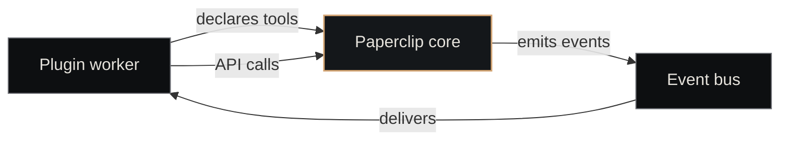

# Paperclip

<p class="lede">Paperclip is the canonical implementation of Nexus's <a href="../../architecture/platform-layer/">platform layer</a> — the control plane that owns canonical entity state for the whole substrate. Companies, tickets, agents, plugins, routines, contracts: every one of them has a row in Paperclip's database, and every other component reads from there.</p>

<div class="page-meta">
  <span class="badge"><span class="dot"></span> living document</span>
  <span>Updated 2026-05-19</span>
  <span>Owner: Platform</span>
</div>

## What it is

A TypeScript HTTP server with an embedded Postgres store, exposing CRUD over the platform-layer entity set plus a webhook/event surface for plugins to extend it. Shipped as the `paperclipai` npm binary; runs as a systemd service in production.

| Property | Value |
|---|---|
| **Binary** | `~/.npm-global/bin/paperclipai` |
| **systemd unit** | `paperclip.service` |
| **HTTP port** | `3100` (loopback only) |
| **Database** | embedded Postgres on port `54329` |
| **Data dir** | `~/Projects/nexus/paperclip/data/` |
| **Config** | `data/instances/default/config.json` |

## What it owns

Paperclip is the source of truth for these entity types. Other components query Paperclip to know what exists.

| Entity | What it represents |
|---|---|
| **Company** | A unit of work scope (domain or craft). See [Companies](../concepts/companies.md). |
| **Ticket** | A single work item with a state-machine lifecycle. See [Tickets](../concepts/tickets.md). |
| **Agent** | A configured worker — prompt + tools + model. Registered, then invoked. |
| **Plugin** | A typed extension to Paperclip (workers + tools, e.g., `paperclip-plugin-acp`). |
| **Routine** | A scheduled recurring task (cron-style spec). |
| **Contract** | A formal agreement between two companies. See [ADR-043](../concepts/decisions-index.md). |
| **Session** | One agent invocation. Pointer-only — full transcript lives in [Nexus Memory](nexus-memory.md). |

Each entity has a stable UUID, an audited state, an owner (a company), and an event stream.

## The HTTP surface

Paperclip exposes a Linear-style REST API on `http://127.0.0.1:3100/api/...`. Endpoints follow a consistent shape:

```bash
# List entities scoped to a company
curl http://127.0.0.1:3100/api/companies/<company_id>/tickets

# Read a specific entity
curl http://127.0.0.1:3100/api/tickets/<ticket_id>

# Transition state (atomic)
curl -X POST http://127.0.0.1:3100/api/tickets/<ticket_id>/claim \
     -d '{"agent_id": "<agent_id>"}'

# Health check
curl http://127.0.0.1:3100/api/health
```

Full surface is reference-documented at [API — Paperclip](../reference/api-paperclip.md). Key principles:

- **Reads are non-locking.** Anyone can query state at any time.
- **Writes are durable before responding.** A 200 means the row has hit the WAL.
- **State transitions are atomic.** Claim, complete, merge — all single-shot operations with rollback-on-error.

## The plugin model

Paperclip is built to be extended. Plugins declare workers and tools, register on startup, and receive events from the core via the event bus.



The canonical plugins shipped with Nexus:

- **[paperclip-plugin-acp](plugins/acp.md)** — session lifecycle for agent dispatches (spawn, send, cancel, close)
- **[paperclip-plugin-contracts](plugins/contracts.md)** — contract lifecycle between companies
- **[paperclip-plugin-craft-dispatch](plugins/craft-dispatch.md)** — domain→craft dispatch + flow-back
- **[paperclip-plugin-memory](plugins/memory.md)** — bridge to [Nexus Memory](nexus-memory.md) (5 MCP tools)

Plugins are versioned independently of Paperclip core. See the [plugin lifecycle DFA](https://github.com/) in `docs/state-machines.md` (DFA 23).

## Storage

Paperclip runs an **embedded Postgres** on port `54329`. The database isn't shared — every entity write goes through Paperclip's API, so there are no external readers/writers to coordinate.

```bash
# Snapshot the live state for debugging
sqlite3-equivalent  # actually: pg_dump from the embedded instance
PGPORT=54329 pg_dump -U paperclip paperclip > snapshot.sql
```

Backups are part of the cold-snapshot routine documented in the [Memory layer](../architecture/memory-layer.md) section (the snapshot scripts also capture Paperclip's DB).

## Configuration

The active instance config lives at `data/instances/default/config.json`. Common settings:

```json
{
  "database": { "mode": "embedded", "port": 54329 },
  "auth":     { "mode": "loopback-only" },
  "logging":  { "level": "info", "path": "logs/paperclip.log" },
  "storage":  { "provider": "local", "path": "data/storage" },
  "secrets":  { "provider": "env" }
}
```

Environment variables (set by the systemd unit):

```bash
# Where Paperclip stores its data (database + plugin state + logs).
PAPERCLIPAI_DATA_DIR=~/Projects/nexus/paperclip/data

# Anthropic base URL — points at Meridian, the local proxy that
# routes Claude calls through.
ANTHROPIC_BASE_URL=http://127.0.0.1:3456

# (per-instance) Bind address; loopback by default.
PAPERCLIPAI_HOST=127.0.0.1
PAPERCLIPAI_PORT=3100
```

## Running it

### systemd (recommended)

```bash
# Start
systemctl --user start paperclip

# Status
systemctl --user status paperclip

# Logs
journalctl --user -u paperclip -f
```

### Manual

```bash
cd ~/Projects/nexus/paperclip
PAPERCLIPAI_DATA_DIR="$(pwd)/data" paperclipai
```

## Why Paperclip and not "just postgres"

Why have a layer in front of the database at all? Three reasons:

1. **State-machine enforcement.** Paperclip is the only thing that lets a ticket transition from `in_review` to `done` — and only when there's a recorded approve verdict and the merge agent succeeded. Bypassing Paperclip and editing the DB directly would break the substrate.
2. **Event emission.** Every state change emits an event to the bus. Plugins react to these. A direct DB write doesn't emit, and plugins would silently fall out of sync.
3. **Plugin coordination.** Paperclip is where plugins meet: it owns the registry, the event bus, the tool-list. Without it each plugin would have to wire to every other plugin.

## See also

- [Platform Layer](../architecture/platform-layer.md) — the architecture page this component implements
- [API — Paperclip](../reference/api-paperclip.md) — endpoint reference
- [Tickets](../concepts/tickets.md), [Companies](../concepts/companies.md) — the most-touched entity types
- [Plugins overview](plugins/index.md) — how Paperclip is extended
- [Nexus Core](nexus-core.md) — the component that reads from Paperclip to dispatch work
- [Nexus Memory](nexus-memory.md) — where Paperclip's session pointers actually link to
