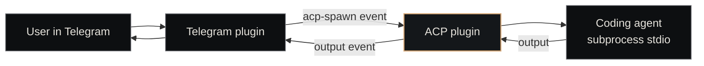

# ACP Plugin

<p class="lede"><code>paperclip-plugin-acp</code> is the <strong>Agent Client Protocol runtime</strong> for Paperclip — it spawns coding agents (Claude Code, Codex, Gemini CLI, OpenCode) as stdio subprocesses and manages thread-bound sessions for chat platforms. Without it, the <code>/acp spawn</code>, <code>/acp status</code>, and <code>/acp close</code> commands in Telegram / Slack / Discord plugins have nothing to connect to.</p>

<div class="page-meta">
  <span class="badge"><span class="dot"></span> living document</span>
  <span>Updated 2026-05-19</span>
  <span>Owner: Platform</span>
</div>

## What it is

A Paperclip plugin that bridges chat-platform events to coding-agent subprocesses over the [Agent Client Protocol](https://agentclientprotocol.com/) (a standard created by Zed Industries). When a chat plugin emits an `acp-spawn` event, the ACP plugin starts an agent subprocess, binds it to the originating thread, and pipes the agent's output back to the chat plugin as `output` events.

| Property | Value |
|---|---|
| **Path** | `~/Projects/nexus/paperclip-plugin-acp/` |
| **npm package** | `paperclip-plugin-acp` |
| **Plugin SDK** | `@paperclipai/plugin-sdk` |
| **Manifest ID** | `paperclip-plugin-acp` |
| **Language** | TypeScript (compiled to ESM) |
| **Test count** | ~50 covering session lifecycle, 1:N support, idle timeout, migration |

## Supported agents

| Agent | Command | Status |
|---|---|---|
| Claude Code | `claude` | Supported |
| Codex CLI | `codex` | Supported |
| Gemini CLI | `gemini` | Supported |
| OpenCode | `opencode` | Supported |

Agents must be installed on the Paperclip server — the plugin spawns them as subprocesses, it doesn't bundle them.

## Session model: 1:N thread binding

A single chat thread can run up to **5 concurrent agent sessions** (configurable via `maxSessionsPerThread`). This lets one thread combine multiple agents — e.g. Claude Code reviewing while Codex implements — and route messages to specific sessions by session ID.

Active sessions are tracked per-thread as an array under the key `acp_sessions_{chatId}_{threadId}`. Closed and errored sessions are dropped from the array and don't count toward the cap. Sessions auto-close on three triggers:

| Trigger | Default | Configurable via |
|---|---|---|
| **Idle timeout** | 30 min of inactivity | `sessionIdleTimeoutMs` |
| **Max age** | 8 hours of total runtime | `sessionMaxAgeMs` |
| **Graceful close** | `/acp close` or `acp-close` event | n/a |

Two session modes:

- `persistent` — agent stays alive for follow-up prompts within the same thread (default for chat-driven workflows)
- `oneshot` — single task, auto-close after completion (default for ticket-driven dispatch)

## Per-dispatch Claude model selection

When the `claude` agent is spawned for a Paperclip ticket, the model is resolved per-dispatch from ticket signals rather than inherited from the user's CLI default. Resolver lives at `src/model-selection.ts` (`resolveModel(ticket)`).

Resolution order (first match wins):

1. **`ACP_MODEL_OVERRIDE` env var** — global ops kill-switch. When set, every Claude dispatch uses this value. Use under Opus-quota pressure to pin everything to Sonnet (e.g. `ACP_MODEL_OVERRIDE=claude-sonnet-4-6`).
2. **Ticket override** — `metadata.model` field on the issue, or a label like `model:claude-haiku-4-5`. Lets the ticket author force a specific model.
3. **Sonnet-eligible label** — `mechanical`, `parallel-safe`, `scaffold`, or `chore`. Marks bounded, low-judgment work → Sonnet.
4. **Priority heuristic** — `critical` / `high` / `medium` → Opus; `low` → Sonnet.
5. **Fallback** → Opus.

Medium priority defaults to Opus because most Nexus tickets involve judgment (design decisions, audits, architectural calls); Opus is the conservative default. To explicitly mark a ticket Sonnet-eligible, add one of the labels above, set `metadata.model`, or mark it `low` priority.

Only the `claude` agent participates in per-dispatch selection — `codex`, `gemini`, `opencode` keep their static argv.

## Cross-plugin event protocol

Chat plugins communicate with the ACP plugin via namespaced events on Paperclip's event bus.

**Inbound (chat plugin → ACP)**:

| Event suffix | Payload | Description |
|---|---|---|
| `acp-spawn` | `{ agentName, chatId, threadId, companyId, cwd?, mode? }` | Spawn a session bound to a thread |
| `acp-message` | `{ sessionId, text }` | Send a prompt to a running session |
| `acp-cancel` | `{ sessionId }` | SIGINT the current turn (keeps session alive) |
| `acp-close` | `{ sessionId }` | SIGTERM + drop thread binding |

**Outbound (ACP → chat plugin)**:

| Event | Payload | Description |
|---|---|---|
| `output` | `{ sessionId, type, text?, error?, chatId, threadId }` | Agent output routed back to the originating thread |

The ACP plugin pre-registers listeners for Telegram, Slack, and Discord on startup. Adding a new platform requires adding its plugin ID to `CHAT_PLATFORM_PLUGINS` in `constants.ts` — no other code changes.

## Agent-facing tools

The plugin registers these tools so that agents (dispatched by Paperclip, not chat-platform users) can themselves manage ACP sessions:

| Tool | Purpose |
|---|---|
| `acp_spawn` | Start a new coding agent session (agent, mode, cwd, initial prompt) |
| `acp_status` | List active sessions with uptime, idle time, and binding info |
| `acp_send` | Send a prompt to an active session |
| `acp_cancel` | Cancel the current turn (SIGINT) |
| `acp_close` | Close a session and remove thread bindings |

## How a chat-driven session flows



The chat plugin owns the human-facing UI; the ACP plugin owns the subprocess. Neither knows about the other's internals — only the event protocol.

## Configuration

Set via Paperclip's instance-config UI or the `/api/plugins/<id>/config` endpoint:

| Setting | Default | Description |
|---|---|---|
| `enabledAgents` | `claude,opencode` | Comma-separated list of enabled agents |
| `defaultAgent` | `claude` | Agent used when none specified |
| `defaultMode` | `oneshot` | `persistent` or `oneshot` |
| `defaultCwd` | (project-specific) | Working directory for spawned agents |
| `sessionIdleTimeoutMs` | `1800000` | Close idle sessions after 30 min |
| `sessionMaxAgeMs` | `28800000` | Close sessions after 8 hours |
| `maxSessionsPerThread` | `5` | Max concurrent sessions per chat thread |

The plugin also reads `ACP_MODEL_OVERRIDE` from the host environment (not plugin config) for the global Claude-model kill-switch described above.

## Lazy migration from 1:1 binding

Older threads used a 1:1 binding key (`acp_{chatId}_{threadId}`). On first access these are migrated automatically: the old key is read, converted to a single-entry sessions array under the new `acp_sessions_{chatId}_{threadId}` key, and the old key is deleted. No manual migration step.

## Install

```bash
# From npm
npm install paperclip-plugin-acp

# Or register with a running Paperclip instance
curl -X POST http://127.0.0.1:3100/api/plugins/install \
  -H "Content-Type: application/json" \
  -d '{"packageName":"paperclip-plugin-acp"}'
```

Auto-publishes to npm on push to `main` via OIDC trusted publishing.

## See also

- [Plugins overview](index.md) — the plugin model in general
- [Paperclip](../paperclip.md) — the host that loads this plugin
- [Nexus Core](../nexus-core.md) — what triggers ticket-driven `acp_spawn` calls
- [Heartbeat](../../concepts/heartbeat.md) — the dispatch loop that calls into ACP
- [Sessions vs Tickets](../../concepts/sessions-vs-tickets.md) — the distinction this plugin enforces in practice
