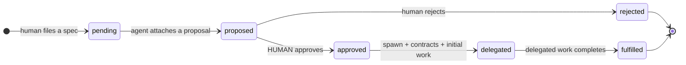

# Agora (Governance Plugin)

Agora is the governance company's console and the implementation of the company spawn pipeline: specs arrive, agents propose, a human approves, and new companies are born fully formed — class, lineage, agents, and a first project all derived from the spec that justified them.

   living document
  Updated 2026-06-04
  Owner: Platform

## What it is

A Paperclip plugin hosted inside the governance company. It owns exactly one piece of state — the **spec lifecycle** — and composes everything else from canonical primitives: spawning goes through canonical provisioning, class and lineage land in the shared [class register](../../concepts/two-class-companies.md#where-class-lives), and delegation creates real [contracts](contracts.md) through the Contracts plugin's own tools. One fact, one home ([ADR-045 §6](../../concepts/decisions-index.md)).

| | |
|---|---|
| **Implements** | ADR-045 (spawn pipeline), ADR-046 (class register integration) |
| **State owned** | `specs` + `spec_events` (plugin namespace) — nothing else |
| **Reads/writes** | Class register + contracts via direct shared-table access; companies via the platform API |
| **UI** | Governance console page (Specs / Children / Contracts tabs), dashboard widget |

## The spec lifecycle

The `proposed → approved` transition is the **mandatory human gate** — agents draft, a human signs off, always. Every transition and spawn is recorded in `spec_events`, which doubles as the idempotency record: replaying an approval or a spawn returns the existing result instead of duplicating it.

## What a spawn produces

The spec that justifies a company also *defines* it. Approval and spawn yield, in one provenance thread:

1. **Company record** — created through canonical provisioning, never a bare row
2. **Class + lineage** — written to the class register at birth (`--class`, parent edge)
3. **Agents with a mandate** — the persistent leads carry the spec's content in their capabilities
4. **A first project** — named after the spec, repo bound as its workspace: the company starts with the reason it exists already on its board
5. **A contract** — the governance company (client) binds the child (vendor) to the proposal's delegation plan as acceptance criteria, with the initial work issue linked as fulfillment

## Tools exposed to agents

| Tool | Purpose |
|---|---|
| `list_specs` | Read the spec queue for a governance company (filterable by status) |
| `propose_implementation` | Attach an implementation proposal — which companies to create or reuse, and the delegation plan |
| `create_child_company` | Spawn an approved spec's child: company record, class + lineage, provisioning hand-off. Idempotent on the spec. |
| `delegate_spec` | Execute the delegation: contract per child (via the Contracts plugin), initial work issue, fulfillment link, spec → `delegated`. Idempotent at two levels. |

Cross-plugin composition (delegation creating contracts) forwards the **caller's own runContext**, so downstream authorization — contracts' "the caller must be client or vendor" rule — always sees the real principal.

## The console

Visible on every company, gated by class: governance-class companies get the full console (spec submission and approval, children with class/lineage/originating-spec detail, contracts with acceptance-criteria checklists and linked issues); domain and craft companies see a read-only explainer. The page existing everywhere is deliberate — governance is a *behaviour*, and any company could be promoted into it ([recursive governance](../../concepts/two-class-companies.md#the-governance-class)).

## See also

- [Company classes](../../concepts/two-class-companies.md) — the taxonomy this plugin operates on, and the governance class it serves
- [Contracts plugin](contracts.md) — delegation's binding primitive
- [Craft Dispatch plugin](craft-dispatch.md) — how delegated domain work reaches craft companies
- [Create a Company](../../guides/create-a-company.md) — the canonical provisioning flow spawns reuse
- [Decisions Index](../../concepts/decisions-index.md) — ADR-045, ADR-046
