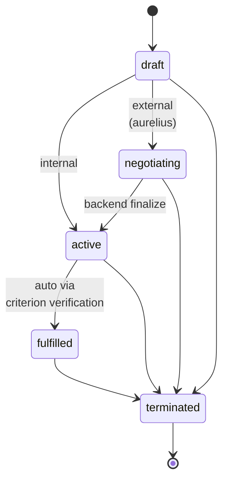

# Contracts Plugin

<p class="lede"><code>paperclip-plugin-contracts</code> is the <strong>first-class contract primitive</strong> for inter-company agreements. It manages contract lifecycle (draft → active → fulfilled), tracks acceptance criteria verification, and links contracts to the issues that source or fulfill them. The plugin implements <a href="../../concepts/decisions-index.md">ADR-043</a>.</p>

<div class="page-meta">
  <span class="badge"><span class="dot"></span> living document</span>
  <span>Updated 2026-05-19</span>
  <span>Owner: Platform</span>
</div>

## What it is

A Paperclip plugin (TypeScript / `@paperclipai/plugin-sdk`) that turns "company A asks company B to do X" from a Slack message or a one-off ticket into a *first-class, queryable, state-machine-guarded entity* on the substrate. Contracts have UUIDs, statuses, structured acceptance criteria, and an audit trail.

| Property | Value |
|---|---|
| **Path** | `~/Projects/nexus/paperclip-plugin-contracts/` |
| **npm package** | `paperclip-plugin-contracts` |
| **Manifest ID** | `paperclip-plugin-contracts` |
| **Storage** | Paperclip's embedded Postgres (`postgres://...:54329/paperclip`) |
| **Design doc** | [ADR-043](../../concepts/decisions-index.md) |

## Why it exists

Before this plugin, cross-company work was implicit: company A would file a ticket in company B's tracker, maybe with a slack hand-off, and "done" meant whatever the implementer thought it meant. Two failure modes recurred:

1. **Drift between expectations and delivery** — A wanted X, B delivered close-to-X, no one re-read the original ask
2. **No audit trail** — when "is this done?" came up later, nobody could point at *the agreement* that defined done

Contracts make the agreement itself a tracked artifact. ADR-043 has the full motivation.

## The lifecycle

A contract is a state machine with five named states. Transitions are guarded by the plugin — bad transitions return an error, no matter what the API caller wants.



| Status | Meaning |
|---|---|
| `draft` | Created; not yet binding |
| `negotiating` | External counterparty is negotiating via the Aurelius backend |
| `active` | Both sides have committed; work in flight |
| `fulfilled` | All acceptance criteria verified — automatic transition |
| `terminated` | Cancelled (chairman or backend-abandoned); terminal |

The state machine is encoded in `src/constants.ts:VALID_TRANSITIONS`. Notice that `fulfilled → terminated` is allowed (per ADR-043 "any non-terminal → terminated" rule, plus a deliberate fulfilled-can-be-rescinded exception); `terminated` is terminal.

## Acceptance criteria

A contract carries a structured list of criteria, each with a stable ID:

```json
{
  "acceptance_criteria": [
    { "id": "ac-1", "text": "API exposes /v1/contracts CRUD endpoints" },
    { "id": "ac-2", "text": "End-to-end test covers create + verify flow" },
    { "id": "ac-3", "text": "Metrics emit on every state transition" }
  ]
}
```

Verification happens one criterion at a time via `verify_acceptance_criterion`. When the last unverified criterion flips, the plugin *automatically* transitions the contract to `fulfilled`. There's no separate "mark fulfilled" call — fulfillment is derived from criteria, never declared.

## Issue linkage

Contracts and issues link in both directions:

- **`source`** — the issue that *originated* the contract (the chairman's "we need X from B" ticket)
- **`fulfillment`** — the issues doing the actual work (B's engineering tickets that satisfy the criteria)

This is what makes "what's blocking contract X?" answerable — query the fulfillment links, filter to `status != done`. And "what did this contract produce?" is the same query in the other direction.

## Tools exposed to agents

The plugin registers five tools via `agent.tools.register`:

| Tool | Purpose |
|---|---|
| `create_contract` | New contract between client + vendor companies, with structured acceptance criteria |
| `list_contracts` | Query contracts by company (matches client OR vendor side), status, or negotiation backend |
| `link_issue_to_contract` | Attach a `source` or `fulfillment` issue link |
| `update_contract_status` | Manual transition (e.g. `active → terminated`); illegal transitions rejected |
| `verify_acceptance_criterion` | Verify one criterion; auto-fulfills the contract when all are verified |

`create_contract` takes a `negotiation_backend` parameter:

- `none` (default) — internal contracts between companies in the same Nexus instance
- `aurelius` — external contracts that route through the Aurelius handshake (pending ADR-044)

## Events emitted

| Event | When |
|---|---|
| `contract.created` | A new contract is created (any backend) |
| `contract.status_changed` | Any legal status transition |
| `contract.fulfilled` | Auto-fulfillment after final criterion verified |
| `contract.criterion_verified` | Any criterion flips to verified |
| `contract.issue_linked` | An issue is linked as source or fulfillment |

Other plugins subscribe to these — e.g. a chairman-facing dashboard plugin can subscribe to `contract.fulfilled` to surface "contracts fulfilled this week."

## Metrics

Counters written to the metrics DB on every operation:

| Metric | Counted on |
|---|---|
| `contracts.created` | Successful create |
| `contracts.errors` | Any tool invocation that throws |
| `contracts.status_changed` | Legal status transitions |
| `contracts.fulfilled` | Auto-fulfillment |
| `contracts.criterion_verified` | Criterion flip |
| `contracts.issue_linked` | Issue linkage |

## Configuration

```json
{
  "paperclipDbPort": 54329
}
```

A single setting: the embedded Postgres port. Defaults to `54329` (Paperclip's standard) — override only if running multiple Paperclip instances on the same host.

## Install

```bash
curl -X POST http://127.0.0.1:3100/api/plugins/install \
  -H "Content-Type: application/json" \
  -d '{"packageName":"paperclip-plugin-contracts"}'
```

## See also

- [Plugins overview](index.md) — the plugin model in general
- [Paperclip](../paperclip.md) — the host that owns contract storage
- [Governance](../../architecture/governance.md) — the layer that makes contracts load-bearing
- [Decisions Index](../../concepts/decisions-index.md) — ADR-043 (this plugin's design doc) and ADR-044 (negotiation backend, pending)
- [Two-class companies](../../concepts/two-class-companies.md) — why contracts matter between domain and craft companies
