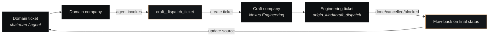

# Craft Dispatch Plugin

<p class="lede"><code>paperclip-plugin-craft-dispatch</code> is the <strong>cross-company ticket bridge</strong>. It lets a domain company create a well-formed engineering ticket in a craft company (e.g. Nexus Engineering) via a single tool call, and flows status back to the source ticket when the engineering work completes.</p>

<div class="page-meta">
  <span class="badge"><span class="dot"></span> living document</span>
  <span>Updated 2026-05-19</span>
  <span>Owner: Platform</span>
</div>

## What it is

A Paperclip plugin that implements the two-class company model in practice. Domain companies do *judgment-heavy* work (research, design, customer relationships); craft companies do *engineering* (code, infra, tests). When a domain company decides "we need engineering for X," it doesn't open a Slack DM — it calls `craft_dispatch_ticket`, which creates a structured ticket in the craft company and threads the link back.

| Property | Value |
|---|---|
| **Path** | `~/Projects/nexus/paperclip-plugin-craft-dispatch/` |
| **npm package** | `paperclip-plugin-craft-dispatch` |
| **Manifest ID** | `paperclip-plugin-craft-dispatch` |
| **Storage** | Paperclip's embedded Postgres (`postgres://...:54329/paperclip`) |
| **Design doc** | [ADR-037](../../concepts/decisions-index.md) (cross-company dispatch mechanism) + [ADR-042](../../concepts/decisions-index.md) (ticket-flag protocol). The ticket-spec shape references a planned ADR-038 (engineering ticket contract) — referenced in source comments, not yet written. |

## Why it exists

Without the plugin, the domain → craft hand-off has the same problems as any cross-team work: under-specified tickets, no traceability, no automatic close-the-loop. The plugin makes the hand-off *structural*:

1. **Schema-enforced spec** — the craft ticket has to carry repo, branch base, files of interest, acceptance criteria, and a clean priority — no "fix the thing in the place" tickets
2. **Origin tracking** — every dispatched ticket carries `origin_kind=craft_dispatch` plus an `origin_id` pointing at the source issue (stored in Paperclip-DB columns the SDK strips from normal tool calls)
3. **Idempotency** — re-dispatching the same source issue with the same content is a no-op, not a duplicate
4. **Flow-back** — when the craft ticket transitions to a *final* status (`done`, `cancelled`, `blocked`), the source ticket is updated with the result

## The dispatch flow



The calling agent must be in a **domain** company — calling the tool from a craft company is an error (engineering shouldn't be dispatching to itself).

## The ticket spec

`craft_dispatch_ticket` takes one tool — and it's intentionally heavy on schema. The spec shape is enforced by the tool's `parametersSchema` and mirrors the engineering-ticket contract referenced (as ADR-038) in source comments:

```json
{
  "target_company": "nexus-engineering",
  "source_issue_id": "<uuid of domain ticket>",
  "spec": {
    "title": "Add retry logic to the embedder client",
    "description": "Markdown body with full context...",
    "ticket_type": "build",                       // or "review"
    "acceptance_criteria": [
      "Embedder retries on 5xx with exponential backoff",
      "Max 3 retries; final failure surfaces to caller",
      "Unit tests cover the retry path"
    ],
    "codebase_context": {
      "repo": "nexus-memory",
      "branch_base": "main",
      "files_of_interest": ["api/server.py", "context1/embedder.py"]
    },
    "priority": "high",
    "flags": { /* per ADR-042 ticket-flag protocol */ }
  }
}
```

Every required field is enforced by the tool's `parametersSchema`. A domain agent that tries to dispatch a vague ticket gets a schema error back, not a confused engineer two days later.

## Origin tracking

Two columns on the engineering ticket distinguish dispatched work from normally-filed work:

| Column | Value |
|---|---|
| `origin_kind` | `craft_dispatch` (constant from `constants.ts:ORIGIN_KIND`) |
| `origin_id` | UUID of the source domain ticket |

The Paperclip SDK strips these fields from ordinary tool inputs to prevent forgery, so the plugin writes them directly via the Postgres connection (`PAPERCLIP_DB`). The columns are read-only from the agent surface — only this plugin can set them.

## Flow-back

The plugin subscribes to ticket-status events on the engineering side. Only **final** transitions trigger flow-back:

| Trigger status | Source-ticket update |
|---|---|
| `done` | Source ticket gets a completion activity-log entry + status update per ADR-042 |
| `cancelled` | Source ticket gets a cancellation entry; remains open |
| `blocked` | Source ticket gets a blocker entry; chairman is the implicit reviewer |

Intermediate transitions (e.g. `todo → in_progress`) are ignored — flow-back is intentionally low-noise. The list of triggers lives in `FLOWBACK_TRIGGER_STATUSES` in `constants.ts`.

## Idempotency

`craft_dispatch_ticket` is keyed on `source_issue_id` — `dispatch.ts` calls `findExistingDispatch(params.source_issue_id)` before creating anything. If there's already a non-cancelled dispatch for that source ticket, the second call returns the existing dispatched ticket instead of creating a new one. The `craft_dispatch.idempotent_hit` metric counts hits.

This matters because retry loops are real: a network blip during the first call shouldn't double-file the work. Note the implication — re-dispatching the same source ticket with a *different* spec still returns the existing dispatch. If you need a fresh dispatch, cancel the old one or file a new source ticket.

## Metrics

| Metric | Counted on |
|---|---|
| `craft_dispatch.dispatched` | Successful new dispatch |
| `craft_dispatch.errors` | Tool invocation failure |
| `craft_dispatch.idempotent_hit` | Duplicate dispatch deduplicated |
| `craft_dispatch.flowback.received` | Engineering-side trigger event arrived |
| `craft_dispatch.flowback.applied` | Source ticket successfully updated |
| `craft_dispatch.flowback.errors` | Flow-back update failed (e.g. source ticket missing) |

The `received` vs `applied` split lets you spot flow-back regressions specifically.

## Configuration

```json
{
  "paperclipDbPort": 54329
}
```

Same minimal config as the [Contracts plugin](contracts.md) — just the Postgres port.

## Install

```bash
curl -X POST http://127.0.0.1:3100/api/plugins/install \
  -H "Content-Type: application/json" \
  -d '{"packageName":"paperclip-plugin-craft-dispatch"}'
```

## See also

- [Plugins overview](index.md) — the plugin model in general
- [Paperclip](../paperclip.md) — the host
- [Two-class companies](../../concepts/two-class-companies.md) — the domain-vs-craft distinction this plugin enforces
- [Contracts](contracts.md) — the *cousin* plugin (formal cross-company agreements); craft-dispatch is the *informal* one
- [Companies](../../concepts/companies.md) — the entity that this plugin bridges between
- [Decisions Index](../../concepts/decisions-index.md) — ADRs 037, 038, 042 that define the contract
