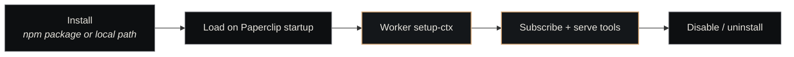

# Plugins Overview

<p class="lede">Paperclip is extensible through <strong>plugins</strong> — npm packages that declare workers, tools, and event handlers, then attach to a running Paperclip instance via its event bus and HTTP API. The four canonical plugins (ACP, Contracts, Craft Dispatch, Memory) implement most of what makes Nexus more than a ticket tracker.</p>

<div class="page-meta">
  <span class="badge"><span class="dot"></span> living document</span>
  <span>Updated 2026-05-19</span>
  <span>Owner: Platform</span>
</div>

## What a plugin is

A plugin is an npm package with a `paperclipPlugin` block in its `package.json` pointing at two compiled entry points:

```json
"paperclipPlugin": {
  "manifest": "./dist/manifest.js",        // declarative metadata
  "worker":   "./dist/worker.js"           // runtime code
}
```

The **manifest** tells Paperclip what the plugin can do: which categories it sits under (`automation`, `connector`), which capabilities it needs (`events.subscribe`, `agent.tools.register`, `http.outbound`), what tools it registers, and what instance-level config it accepts.

The **worker** is the actual code: it subscribes to events on the Paperclip bus, exposes registered tools to agents, makes outbound HTTP calls, and writes to the activity log and metrics surfaces.

## The capability model

Plugins declare capabilities up-front in their manifest. The host enforces these — a plugin that didn't declare `http.outbound` cannot make outbound HTTP calls, no matter what its worker code tries. Common capabilities:

| Capability | What it grants |
|---|---|
| `events.subscribe` | Receive events from Paperclip's bus (issue.created, status.changed, etc.) |
| `events.emit` | Publish events to the bus (other plugins can subscribe) |
| `http.outbound` | Make HTTP calls to external services |
| `plugin.state.read` / `plugin.state.write` | Persist plugin-scoped state across restarts |
| `activity.log.write` | Write entries to the per-entity activity timeline |
| `metrics.write` | Write metrics into the metrics DB |
| `agent.tools.register` | Expose tools to agents dispatched against this Paperclip instance |

This is the substrate's way of making plugins *legible to operators* — a glance at the manifest tells you what surface area a plugin touches.

## The four canonical plugins

These ship with Nexus and implement most of the operational surface:

| Plugin | Page | What it does |
|---|---|---|
| **ACP Runtime** | [acp](acp.md) | Spawn coding agents (Claude Code, Codex, Gemini, OpenCode) as subprocesses over stdio; manage 1:N thread-bound sessions for chat platforms |
| **Contracts** | [contracts](contracts.md) | First-class inter-company contract primitive — lifecycle, acceptance criteria verification, issue linkage. Implements [ADR-043](../../concepts/decisions-index.md). |
| **Craft Dispatch** | [craft-dispatch](craft-dispatch.md) | Cross-company ticket bridge — domain companies dispatch engineering work to craft companies (e.g. Nexus Engineering); flow-back updates source ticket on completion |
| **Memory** | [memory](memory.md) | Agent-facing tools for reading and writing [Nexus Memory](../nexus-memory.md) — `memory_retrieve`, `memory_search`, `memory_remember`, `memory_wake_up`, `memory_status` |

Each plugin's tool surface gets registered into the dispatched agent's MCP tool list at session start — they show up alongside Paperclip's built-in ticket tools and any MCP server tools (like [Nexus MCP](../nexus-mcp.md)).

## The plugin lifecycle



DFA 23 in `docs/state-machines.md` is the canonical lifecycle reference. The states (`pending → installed → active → disabled → uninstalled`) and the legal transitions between them are enforced by Paperclip.

## Cross-plugin communication

Plugins talk to each other through namespaced events on the Paperclip bus, never directly. Each plugin's events live under its own namespace:

```
plugin.paperclip-plugin-telegram.acp-spawn
plugin.paperclip-plugin-acp.output
plugin.paperclip-plugin-contracts.contract-fulfilled
```

This means adding a new chat-platform plugin requires zero changes to the ACP plugin — the new plugin just emits events in its own namespace and the ACP plugin's pre-registered listeners (per platform ID list in its constants) pick them up.

## Worker quick-start

The skeleton of a worker:

```ts
import { definePlugin, runWorker } from "@paperclipai/plugin-sdk";

const plugin = definePlugin({
  async setup(ctx) {
    // Subscribe to events
    ctx.events.on("issue.created", async (event) => {
      ctx.logger.info("Issue created", { issueId: event.entityId });
    });

    // Register an agent tool
    ctx.tools.register("hello", {
      displayName: "Hello",
      description: "Say hello",
      parametersSchema: {
        type: "object",
        properties: { name: { type: "string" } },
        required: ["name"],
      },
    }, async (params) => {
      return { content: `Hello, ${params.name}!` };
    });
  },
});

runWorker(plugin);
```

The `ctx` object handed to `setup` is the plugin's whole surface area: events, logger, data/action/tool registries, activity log, metrics, state read/write, HTTP client. What it has access to is gated by the capabilities declared in the manifest.

## Installation

Plugins are installed via the Paperclip API:

```bash
curl -X POST http://127.0.0.1:3100/api/plugins/install \
  -H "Content-Type: application/json" \
  -d '{"packageName":"paperclip-plugin-acp"}'
```

Or, for local development, by pointing at a local path (treated as a dev convenience, not the supported deployment path):

```bash
curl -X POST http://127.0.0.1:3100/api/plugins/install \
  -d '{"packagePath":"~/Projects/nexus/paperclip-plugin-acp"}'
```

Paperclip clones/links the package, runs the install lifecycle, calls `setup(ctx)` on the worker, and registers all declared tools + event handlers.

## Authoring a new plugin

The full walkthrough lives in [Create a Plugin](../../guides/create-a-plugin.md). The short version:

1. Scaffold from the template — `npm create paperclip-plugin@latest`
2. Edit the manifest — declare ID, version, capabilities, tools
3. Implement the worker — `definePlugin` with `setup(ctx)`
4. `npm run build` to produce `dist/`
5. `curl ... /api/plugins/install` to register against a running Paperclip

## See also

- [Paperclip](../paperclip.md) — the host that loads plugins
- [Create a Plugin](../../guides/create-a-plugin.md) — operational walkthrough
- [ACP plugin](acp.md), [Contracts plugin](contracts.md), [Craft Dispatch plugin](craft-dispatch.md), [Memory plugin](memory.md) — the canonical four
