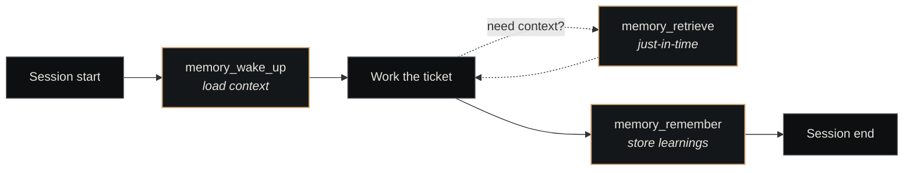

# Memory Plugin

<p class="lede"><code>paperclip-plugin-memory</code> is the <strong>agent-facing tool surface</strong> over the <a href="../nexus-memory.md">Nexus Memory</a> sidecar. It wraps the REST API at <code>:8102</code> into five plugin-registered tools (<code>memory_retrieve</code>, <code>memory_search</code>, <code>memory_remember</code>, <code>memory_wake_up</code>, <code>memory_status</code>) that get registered into every dispatched agent's MCP tool list.</p>

<div class="page-meta">
  <span class="badge"><span class="dot"></span> living document</span>
  <span>Updated 2026-05-19</span>
  <span>Owner: Platform</span>
</div>

## What it is

A thin TypeScript plugin that talks to the [Nexus Memory](../nexus-memory.md) REST sidecar and re-exposes its operations as Paperclip-registered tools. It does no storage of its own — every call passes through to `http://127.0.0.1:8102/v1/...`.

| Property | Value |
|---|---|
| **Path** | `~/Projects/nexus/paperclip-plugin-memory/` |
| **npm package** | `paperclip-plugin-memory` |
| **Manifest ID** | `paperclip-plugin-memory` |
| **Talks to** | Nexus Memory REST API at `http://127.0.0.1:8102` |
| **Capabilities** | `http.outbound`, `activity.log.write`, `agent.tools.register` |

## Why a plugin and not direct MCP?

The MemPalace and Context-1 MCP servers ([Nexus Memory](../nexus-memory.md) ships both) expose memory tools to *Claude Code sessions launched from the CLI* — that's how a developer using Claude Code on their own machine reaches memory.

This plugin serves a different audience: **agents dispatched by Paperclip**. Paperclip plugins are the canonical way to attach tools to dispatched agents — they register through `agent.tools.register`, and the dispatched agent sees them in its MCP tool list at session start. Without this plugin, an agent dispatched via Paperclip has no memory tools at all.

The plugin also acts as the integration point for other plugins that need memory access — for example, [craft-dispatch](craft-dispatch.md) calls the same REST sidecar (`/v1/retrieve`, `/v1/search`) to enrich tickets with prior context before dispatch.

## The five tools

| Tool | Purpose | Backing endpoint |
|---|---|---|
| `memory_retrieve` | Semantic retrieval over project knowledge via Context-1 | `POST /v1/retrieve` |
| `memory_search` | Search MemPalace for stored memories, decisions, patterns | `POST /v1/search` |
| `memory_remember` | Store a learning, decision, or pattern in MemPalace | `POST /v1/remember` |
| `memory_wake_up` | Get L0+L1 wake-up context (~600-900 tokens) for a wing | `GET /v1/wake-up` |
| `memory_status` | Health + counts for both Context-1 and MemPalace | `GET /v1/status` |

Each tool's `parametersSchema` is defined in `src/manifest.ts`; the worker forwards calls to the REST API via `src/memory-api.ts`.

### `memory_retrieve` — semantic search

For knowledge that should *inform* the agent's reasoning. Ranked vector retrieval against Context-1's ChromaDB collections.

```json
{
  "query": "how does the heartbeat decide which company to dispatch next",
  "collections": ["nexus-docs"],          // optional; defaults to all
  "max_results": 10                       // 1-50, default 10
}
```

### `memory_search` — keyword/lexical search

For finding *specific* drawers when you already know roughly what to look for. Optionally scope by wing and room.

```json
{
  "query": "ADR-043",
  "wing": "nexus",                        // optional project scope
  "room": "decisions",                    // optional aspect scope
  "max_results": 10
}
```

### `memory_remember` — verbatim store

Content is stored *verbatim*, never summarized. The wing + room namespacing lets future retrieval scope effectively. Duplicate detection is content-addressed (writing the same content twice is a no-op).

```json
{
  "content": "Exact decision text — never paraphrase before storing.",
  "wing": "nexus",
  "room": "decisions",
  "source_file": "docs/decisions/0044-...md"   // optional provenance
}
```

The "verbatim, never summarized" constraint is critical — see [Memory Protocol](../../concepts/memory-protocol.md) for the rationale.

### `memory_wake_up` — compressed context

Returns the wing's L0 (top-line) + L1 (recent + load-bearing) context bundle. Designed to be called *once* at session start, not repeatedly. Typical payload is 600–900 tokens.

### `memory_status` — health probe

For ops use, not agent reasoning. Returns wing breakdown, drawer counts, Context-1 collection health.

## When agents call these

Three canonical patterns, in roughly the order an agent should use them in a session:



- **`memory_wake_up`** at session start to load the wing's compressed context bundle (one shot, not repeated)
- **`memory_retrieve`** mid-session when the agent needs specific knowledge it doesn't currently have
- **`memory_remember`** before session close to persist decisions, learnings, surprising findings

## Configuration

```json
{
  "memoryApiBase": "http://127.0.0.1:8102"
}
```

One setting: the REST API base URL. Default is loopback — change only if running Nexus Memory on a different host (unusual).

## How it composes with the rest of the substrate

| Plugin / component | Relationship |
|---|---|
| [Nexus Memory](../nexus-memory.md) | The REST sidecar this plugin wraps |
| [Memory Protocol](../../concepts/memory-protocol.md) | The read/write contract these tools enforce |
| [MemPalace MCP](../nexus-memory.md) | Sibling surface — same backing store, different access path (CLI-side Claude Code sessions) |
| [Context-1 MCP](../nexus-memory.md) | Same — sibling MCP surface, CLI-side |
| [ACP plugin](acp.md) | Both register tools onto dispatched agents; orthogonal concerns |

## Install

```bash
curl -X POST http://127.0.0.1:3100/api/plugins/install \
  -H "Content-Type: application/json" \
  -d '{"packageName":"paperclip-plugin-memory"}'
```

The plugin needs Nexus Memory running (or it'll fail every tool call). Start the sidecar first:

```bash
systemctl --user start nexus-memory
curl http://127.0.0.1:8102/v1/status                 # should return health
```

## See also

- [Plugins overview](index.md) — the plugin model in general
- [Nexus Memory](../nexus-memory.md) — the sidecar this wraps
- [Memory Layer](../../architecture/memory-layer.md) — the architecture this implements at the agent surface
- [Memory Protocol](../../concepts/memory-protocol.md) — read/write contract the tools enforce
- [Wings & Rooms](../../concepts/wings-and-rooms.md) — the taxonomy that `wing`/`room` parameters refer to
