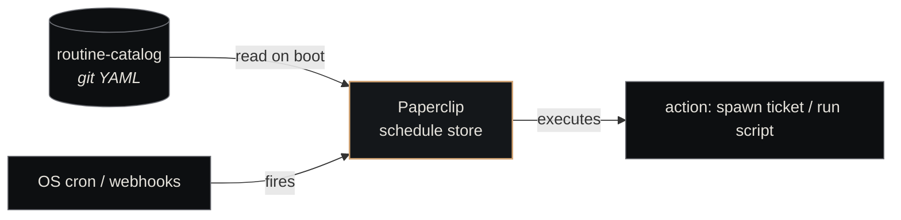

# Routine Catalog

<p class="lede">The Routine Catalog holds definitions for every <strong>scheduled recurring task</strong> in the substrate — queue drains, health checks, stale-ticket sweeps, periodic syncs. Routines are how the substrate keeps itself healthy without manual intervention.</p>

<div class="page-meta">
  <span class="badge"><span class="dot"></span> living document</span>
  <span>Updated 2026-05-19</span>
  <span>Owner: Platform</span>
</div>

## What it is

A git-tracked directory of YAML files, one per routine. On startup, [Paperclip](paperclip.md) reads the catalog and registers each routine against the relevant company, scheduling it via either cron or webhook trigger.

| Property | Value |
|---|---|
| **Path** | `~/Projects/nexus/routine-catalog/` |
| **Format** | YAML (one file per routine at `routines/<id>.yaml`) |
| **Registered via** | `POST /api/companies/{companyId}/routines` on startup |
| **Run by** | [Paperclip](paperclip.md) (the platform layer holds the schedule) |
| **Size** | 9 defined routines as of 2026-05-19 |

## What a routine is (vs. a ticket)

A **ticket** is a one-off unit of work with a clear acceptance criterion. A **routine** is a long-lived schedule that *spawns tickets* (or executes work directly) on a cadence.

| | Ticket | Routine |
|---|---|---|
| Lifecycle | `backlog → todo → in_progress → done` | Persistent — runs until disabled |
| Created | By a human, agent, or another routine | By the catalog (at platform startup) |
| Owner | A company | A company |
| Frequency | Once | Many — defined by trigger |

Routines often produce tickets. "Stale-ticket-sweep" fires daily, finds tickets stuck in `in_review > 24h`, and creates an escalation ticket for each. The escalation tickets are normal one-off work; the sweep is the routine.

## The schema

```yaml
# routines/stale-ticket-sweep.yaml
id: stale-ticket-sweep
version: 1.4.0

owner_company: nexus-engineering    # which company this routine belongs to

trigger:                            # cron OR webhook (exactly one)
  type: cron
  spec: "0 9 * * *"                  # daily at 9am local time
  timezone: Europe/Amsterdam

# Alternative trigger:
# trigger:
#   type: webhook
#   path: /webhooks/github-push       # registered at this path on the API

concurrency_policy:                 # what to do if a run is still active
  mode: skip                         # one of: skip | queue | replace

action:                             # what the routine DOES when it fires
  type: spawn_ticket                 # one of: spawn_ticket | call_tool | run_script
  template: stale-ticket-escalation  # ticket template name (see `templates/`)
  args:
    stale_threshold_hours: 24

paperclip_config:                   # how the routine appears in Paperclip
  visible: true                      # show in the routines UI
  pause_on_error: true               # if the routine fails N times, pause it
  max_errors_before_pause: 3
```

## The nine routines (as of 2026-05-19)

| Routine | Trigger | Purpose |
|---|---|---|
| `company-heartbeat` | cron, every 5 min | Per-company heartbeat — the replacement for the Python `company_heartbeat.py` |
| `health-check` | cron, every 15 min | Periodic health check of all Nexus infrastructure components |
| `cross-company-queue-drain` | cron, every 30 min | When Nexus Engineering's local queue is empty, check all domain companies |
| `stale-ticket-sweep` | cron, every 6 hours | Find tickets stuck in `in_progress` with no recent activity |
| `session-cleanup` | cron, every 4 hours | Clean up stale session state files, zombie processes, orphaned artifacts |
| `company-directory-sync` | cron, daily 3am | Re-seed the MemPalace company directory from the Paperclip API |
| `daily-git-hygiene` | cron, daily 7am | Audit all company git repos for stale branches, uncommitted changes |
| `weekly-metrics-report` | cron, Monday 9am | Generate weekly performance metrics report across all companies |
| `upstream-tracking-check` | cron, Friday 10am | Check all repos for upstream changes that need pulling or rebasing |

(Catalog continues to grow; check `routine-catalog/routines/` for current set.)

## Concurrency policies

Three modes, named for what they do when a routine fires while a previous run is still active:

| Mode | Behavior | Use when |
|---|---|---|
| `skip` | Drop the new fire; let the existing run finish | Idempotent routines where double-running wastes work (`daily-git-hygiene`) |
| `queue` | Hold the new fire; run it when the current one finishes | Cumulative routines where missing a fire matters (`company-heartbeat`) |
| `replace` | Cancel the existing run; start fresh with new one | Routines where the latest state matters most (`health-check`) |

Default is `skip` — safest. Choose deliberately when changing.

## How routines are dispatched



Cron-based routines rely on the host's cron daemon (or [Nexus Core](nexus-core.md)'s heartbeat for sub-minute precision). Webhook-based routines are exposed at a path Paperclip listens on; external systems POST to them.

## Versioning

Same semver rules as the [Agent Catalog](agent-catalog.md):

- **Patch** — bug fix, no behavioral change (e.g., timezone correction)
- **Minor** — additive (new args, new template)
- **Major** — breaking (changed trigger type, changed action type)

Routine performance is tracked per-version in the metrics DB. A routine that starts failing after a minor bump shows up in the data.

## See also

- [Paperclip](paperclip.md) — where routines are scheduled and run
- [Nexus Core](nexus-core.md) — sub-minute trigger source via heartbeat
- [Agent Catalog](agent-catalog.md) — sister catalog for agent definitions
- [Tickets](../concepts/tickets.md) — what routines often spawn
- [Create a Routine](../guides/create-a-routine.md) — operational walkthrough
