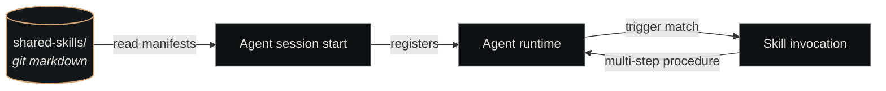

# Skills Catalog

<p class="lede">The Skills Catalog is the registry of reusable <strong>workflow definitions</strong> that any agent in the substrate can invoke. Each skill is a SKILL.md manifest describing a multi-step procedure (review a PR, audit git status, start the platform) that the agent follows when triggered.</p>

<div class="page-meta">
  <span class="badge"><span class="dot"></span> living document</span>
  <span>Updated 2026-05-19</span>
  <span>Owner: Platform</span>
</div>

## What it is

A git-tracked directory of skill manifests, one per skill. Different from the [Agent Catalog](agent-catalog.md) (which defines *who* an agent is) — the Skills Catalog defines *what procedures an agent can run* once it exists.

| Property | Value |
|---|---|
| **Path** | `~/Projects/nexus/shared-skills/` |
| **Format** | Markdown (`SKILL.md` per skill, optionally with sibling `scripts/` directory) |
| **Discovery** | Agents load skill manifests at session start; skill names appear as invocable commands |
| **Size** | 11 production skills as of 2026-05-19 |

## Skills vs. tools — the boundary

The two are easy to confuse. Both extend what an agent can do, but at different levels.

| | Skill | Tool |
|---|---|---|
| **Definition** | Markdown SKILL.md — prose + structure | MCP server tool — function signature + handler |
| **Granularity** | Multi-step workflow (review a PR end-to-end) | Single operation (fetch one PR's diff) |
| **Composition** | Calls many tools + bash + reads/writes | Atomic — one round-trip to a service |
| **Authored by** | Whoever owns the workflow knowledge | Whoever owns the underlying API |
| **Versioning** | Git history on the SKILL.md | Per-MCP-server release |

A skill *uses* tools. The `code-review` skill calls GitHub MCP tools, Paperclip MCP tools, and bash. The tools themselves live in their respective MCP servers (see the [Components](paperclip.md) section for per-server tool lists).

## The 11 production skills

| Skill | Triggered when | What it does |
|---|---|---|
| [`code-review`](#) | An agent is asked to review a PR | Fetches PR + diff via GitHub MCP, runs the Nexus review rubric, posts a structured verdict |
| [`git-safety`](#) | Before a session ends | Verifies all work is committed and pushed; never let a session terminate with uncommitted state |
| [`meeting-participant`](#) | An agent is on a meeting attendee list | Reads agenda, prepares role-specific input, contributes substantively |
| [`nexus-git-audit`](#) | User asks "what's the git state?" / proactive check | Sweeps all Nexus repos for dirty trees, stale branches, uncommitted work |
| [`nexus-start`](#) | User wants to start the platform (post-reboot, etc.) | Starts Paperclip via systemd, Cockpit, and optionally Nexus Core heartbeat |
| [`nexus-status`](#) | User asks "what's running?" / proactive health check | Quick platform health audit: companies, ticket counts, heartbeat health |
| [`nexus-tickets`](#) | Any Paperclip ticket operation | Wraps the Paperclip API correctly, hides priority-mapping + endpoint quirks |
| [`paperclip-api`](#) | Direct Paperclip API interaction needed | Lower-level Paperclip wrapper avoiding known production-failure quirks |
| [`session-cleanup`](#) | Session list getting long (or every 10-15 tasks proactively) | Identifies and closes idle ACP sessions to reduce dispatch-response token cost |
| [`ticket-worker`](#) | An agent is dispatched to work a ticket | The canonical ticket-execution loop: read AC, work, push, commit, post verdict |
| [`wiki-maintainer`](#) | After significant work on a company | Updates the company wiki based on AutoMemory entries + recent activity |

The skills evolve through the same git-tracked PR process as agents.

## The SKILL.md format

Each skill is a single markdown file at `shared-skills/<skill-name>/SKILL.md`. The format is intentionally light — closer to a runbook than a config schema.

```markdown
# Code Review Skill

Review pull requests against Nexus quality standards and provide structured,
actionable feedback.

## Trigger

Invoke when asked to review a PR, e.g.:
  - "Review PR #42 in nexus-holdings/atlas-finance"
  - "Code review this branch"
  - `/code-review <repo> <pr-number>`

## Context Requirements

Before reviewing, gather:
  1. PR details — title, description, linked ticket, author
  2. Diff — full file-by-file changeset
  3. Repo context — language, framework, CLAUDE.md if present
  4. CI status — passing/failing checks

Use the GitHub MCP server tools to fetch these.

## Procedure

[step-by-step]

## Output

[expected structure of the response, e.g., verdict comment format]
```

Some skills also have YAML frontmatter (name + description) for richer discovery — `nexus-status` and `session-cleanup` use that pattern. Both styles work; frontmatter is preferred for new skills.

## The two skill flavors

There's a useful distinction between two kinds of skills:

- **Operational skills** — wrap a workflow (ticket-worker, code-review, meeting-participant). The bulk of the catalog.
- **Verification skills** — explicit checks against a rubric (the `verify-*` family proposed in `nexus-platform-v2-design.md`).

Why the distinction matters: research finding from the platform design doc — **verification skills outperform instruction-only prompts by 4-40 percentage points** on quality metrics. The catalog is gradually adding verification skills as failure modes get postmortems.

## How skills are loaded



At session start, the agent loads relevant skill manifests (filtered by the agent's role + which skills are "wired" for that company). When the agent's reasoning matches a skill's trigger, the skill is invoked — typically as a `/skill-name` slash command — and the agent follows the manifest's procedure.

## Where tools come from (the other half of the picture)

Skills compose tools. Tools come from MCP servers, registered against each agent session at dispatch time:

| MCP server | Tool count | Lives in |
|---|---|---|
| Paperclip | ~20 ticket + company + plugin tools | [Paperclip](paperclip.md) |
| Memory | 25 (MemPalace) + 3 (Context-1) | [Nexus Memory](nexus-memory.md) |
| nexus-mcp | 12 compound chairman tools | [Nexus MCP](nexus-mcp.md) |
| GitHub | repo / PR / issue tools | external `mcp-server-github` |
| Bash | command execution | built-in |

Each server's tools are documented on its own component page — there is no single "tools catalog" repo. Skills reference these tools by their canonical MCP names (e.g., `mcp__paperclip__update_ticket`).

## See also

- [Agent Catalog](agent-catalog.md) — agent definitions that *use* skills + tools
- [Paperclip](paperclip.md) — main source of tool surface
- [Nexus MCP](nexus-mcp.md) — compound chairman-level tools
- [Nexus Memory](nexus-memory.md) — memory tool surface (28 tools)
- [Routine Catalog](routine-catalog.md) — sister catalog (recurring tasks)
- [Eval Registry](eval-registry.md) — sister catalog (scoring rubrics)
