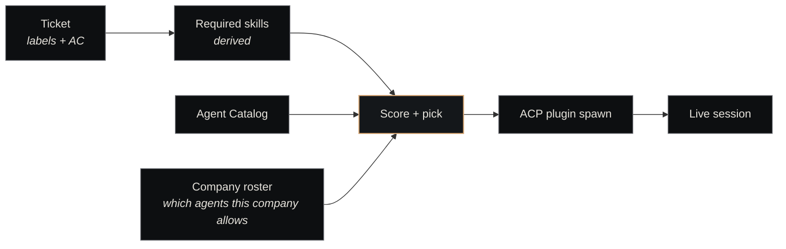

# Agents

<p class="lede">An agent in Nexus is a <strong>configured worker</strong>: a base prompt + a skill set + a tool list + a model config + a performance record. The agent definition is durable and versioned in the catalog; a single agent type spawns many short-lived sessions across many tickets. This page is the concept; <a href="../components/agent-catalog.md">Agent Catalog</a> is the implementation.</p>

<div class="page-meta">
  <span class="badge"><span class="dot"></span> living document</span>
  <span>Updated 2026-05-19</span>
  <span>Owner: Platform</span>
</div>

## What an agent is (and isn't)

An agent is a *configuration*. It's a row in the catalog that says: "when a `backend-engineer` is needed, here's the system prompt to use, here are the skills it announces, here are the tools to expose, here's the default model, and here's how it has performed historically."

That configuration is decoupled from the runtime that *executes* an agent:

| | Agent | Session |
|---|---|---|
| **What it is** | A declarative configuration | A live subprocess running the configuration |
| **Where it lives** | YAML in the `agent-catalog` repo | Process memory + ACP plugin state |
| **Lifetime** | Persistent across versions | Minutes to ~8 hours |
| **Quantity** | A few dozen agent types | Many sessions per type per day |

If you find yourself asking "is this agent still running?" — you mean *session*. Agents themselves aren't running or not running; they're configurations that are *invoked* into sessions.

(For the longer treatment of this distinction see [Sessions vs Tickets](sessions-vs-tickets.md).)

## The five fields that define an agent

Every agent YAML has the same five load-bearing fields:

| Field | What it carries | Example |
|---|---|---|
| **`base_prompt`** | Role description used as system prompt | "You are a senior backend engineer working on Nexus services. Prioritize correctness, test coverage, and observability." |
| **`skills`** | Capability tags for dispatch matching | `[python, postgres, api-design, test-driven-development]` |
| **`tools`** | MCP tools this agent may invoke | `[paperclip_update_ticket, mempalace_search, bash_run]` |
| **`model_config`** | Default model + fallback + session caps | `{default: opus-4-7, fallback: sonnet-4-6, max_age_hours: 8}` |
| **`performance`** | Last-30d KPIs from the metrics DB | `{success_rate: 0.91, median_session_minutes: 23}` |

Three of these are *declarative inputs* the prompt-author writes (base_prompt, skills, tools). One is *behavioural config* (model_config). One is *output of running the agent* (performance) — populated by the substrate, not the author.

## Dispatch — agent meets ticket



When the [heartbeat](heartbeat.md) picks up a ticket, it:

1. **Derives required skills** from the ticket's labels and acceptance criteria
2. **Filters the catalog** to agents whose `skills:` cover the required set
3. **Filters again by company roster** — only agents allowed in the ticket's company are candidates
4. **Scores remaining candidates** on recent success rate, model availability, current load
5. **Provisions the winner** — its `base_prompt`, tools, and model are passed to the [ACP plugin](../components/plugins/acp.md), which spawns the session

The two-stage filter (skills + roster) means an agent in the catalog isn't enough — companies must opt in to using it. This keeps each company's surface scoped to roles that make sense for its work.

## The category taxonomy

Agents are tagged with one of twelve categories (per the live agent-catalog YAMLs):

| Category | Examples |
|---|---|
| `intake` | ticket-triage, requirements-clarifier, intake-creative |
| `review` | code-reviewer, design-reviewer |
| `ticket-creation` | spec-writer, charter-engineer |
| `backend-dev` | backend-engineer, db-migration-specialist |
| `frontend-dev` | frontend-engineer, design-system-engineer |
| `devops` | infra-engineer, sre, observability-engineer |
| `security` | security-engineer, security-auditor |
| `improvement` | refactor-engineer, performance-engineer |
| `design` | ui-designer, ux-researcher |
| `research` | autoresearch-evaluator, autoresearch-mutator |
| `leadership` | chairman, coo |
| `management` | project-manager, program-manager |

The categories serve two purposes: UI grouping (when an operator looks at the catalog) and skill-matching priors (the dispatcher uses category as a coarse first filter before the skill-set match).

## What lives *outside* the agent

A common mistake is treating "agent" as the whole runtime contract. It isn't. Several adjacent things are explicitly *not* part of the agent definition:

| Thing | Where it lives |
|---|---|
| The **session lifecycle** (spawn, idle, close) | The [ACP plugin](../components/plugins/acp.md) |
| The **workflow** (PR review steps, ticket-execution loop) | A [skill](../components/skills-catalog.md) the agent invokes |
| The **atomic tool calls** (fetch PR, update ticket, search memory) | MCP servers that register tools |
| The **performance numbers** | The metrics DB, populated by the substrate |

The agent definition is just the *role* — base prompt + which capabilities to claim + which tools to wire + which model to default to. Workflows, sessions, and tools are separate layers.

## Versioning

Agent definitions are versioned semver, with PR-gated bumps:

| Bump | What it signals | Example |
|---|---|---|
| **Patch** (`x.y.Z`) | Prompt fix, no skill/tool change | "Tightened scope discipline on multi-file edits" |
| **Minor** (`x.Y.0`) | Additive — new skill, new tool, expanded prompt | "Added postgres skill" |
| **Major** (`X.0.0`) | Breaking — removed skill/tool or incompatible prompt rewrite | "Replaced cli-first orientation with api-first" |

Why this matters operationally: the metrics DB tags every performance record with the agent version that produced it. A regression after `2.3.0` shows up in the data; the team can roll back or adjust before the regression compounds.

Major bumps in particular require a `changelog.justification` entry citing KPI evidence — every YAML's `changelog:` list carries this audit trail.

## Teams — agents collaborating

Some work doesn't fit a single agent. The catalog supports *teams* — declarative compositions of agents under a named flow:

```yaml
# teams/code-review.yaml
id: code-review
agents:
  - implementer: backend-engineer
  - reviewer:    code-reviewer
  - merger:      merge-agent
flow:
  - implementer completes ticket
  - reviewer evaluates, posts verdict
  - merger triggers on approve verdict
```

Tickets opt into a team via a `team:code-review` label. The dispatcher then provisions the *whole team* across the ticket's lifecycle — implementer first, then reviewer when the implementer completes, then merger when the verdict lands.

Teams are how the substrate handles work that requires distinct roles (write vs. review vs. merge) without conflating them into a single oversized agent.

## The performance loop

The `performance:` block in each agent YAML is the substrate's lever for *learning which agents are working*:

```yaml
performance:
  metrics:
    success_rate: 0.91
    median_session_minutes: 23
    evals_passed:
      - code-quality@4.2
      - security-scan@1.8
  by_scenario: {...}
  by_model: {...}
```

These numbers are populated by `self-improvement` (a domain company per [two-class companies](two-class-companies.md)) which reads from the metrics DB and writes back into the catalog. The agent definition is *self-updating in the performance block, never elsewhere* — the prompt, skills, and tools change only through human PR.

This split (machine writes performance, human writes definition) is deliberate — it gives the substrate a feedback signal without giving it the power to silently mutate the work it's measuring.

## When to create a new agent

A new agent YAML is justified when:

1. **A new role is needed** that doesn't fit an existing agent's skill set or prompt orientation
2. **An existing agent is overloaded** — one type handling too many distinct kinds of work, and decomposing improves both the prompt clarity and the routing precision
3. **A specific company needs a tailored variant** — though check first whether a per-company roster filter on an existing agent would do the same job

Avoid creating a new agent just to tweak a prompt — that's what minor/patch bumps are for. The catalog grows monotonically; old agents are kept (or marked deprecated), never deleted, because old performance records reference them.

## See also

- [Agent Catalog](../components/agent-catalog.md) — the component page (YAML schema, dispatch, teams)
- [Sessions vs Tickets](sessions-vs-tickets.md) — the runtime / configuration split, in depth
- [Heartbeat](heartbeat.md) — the dispatch loop that turns agents into running sessions
- [Skills Catalog](../components/skills-catalog.md) — workflows that agents follow
- [ACP plugin](../components/plugins/acp.md) — the runtime that hosts sessions
- [Two-class companies](two-class-companies.md) — domain agents vs craft agents differ in role, not in this model
