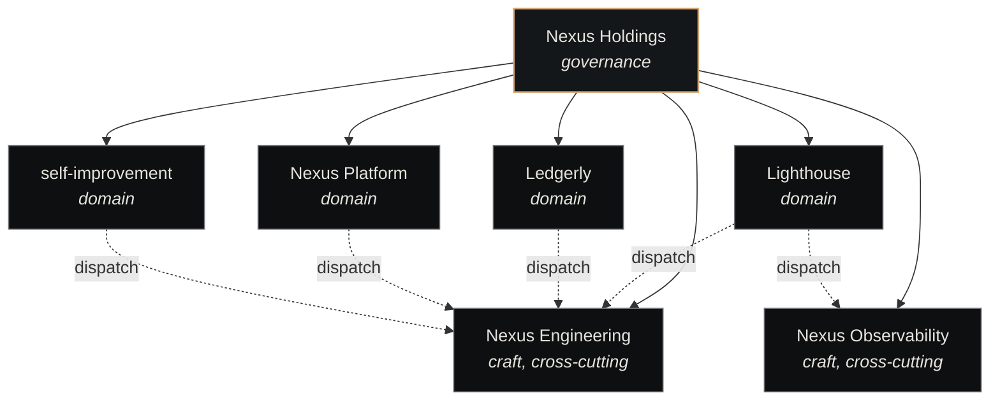

# Companies

A **company** is Nexus's primary unit of work scope. Everything Nexus does — every ticket, every agent spawn, every memory write — is keyed to a company.

## The two-class model

Nexus splits the traditional company structure in two:

```
Traditional company = domain teams + engineering department
                              ↓
Nexus = domain companies (context, strategy, decomposition)
      + craft companies (stateless execution, shared standards)
```

The rationale: when you scale to many products, you don't want N redundant engineering departments. You want N domain teams plus **one** engineering craft company that serves them all.

### Domain companies

A domain company owns a product, a market, or a problem space. It carries:

- **Context** — who the customer is, what the constraints are, what's been tried
- **Strategy** — what to do next, what to defer, what to kill
- **Decomposition** — turning roadmap items into well-formed tickets

A domain company **does not execute**. It hands tickets to a craft company.

### Craft companies

A craft company is a **stateless execution engine**:

| Input | Output |
|---|---|
| A well-formed ticket (title, description, context, acceptance criteria, type) | Committed, tested, pushed code — or a findings report — or observability coverage |

Properties:

- Single craft domain (engineering, observability, research, editorial)
- Standardized ticket input contract — rejects malformed tickets
- Maintains per-project knowledge bases so client contexts don't bleed
- Escalates to the originating domain company when context is insufficient
- Improves continuously — every ticket makes the craft company a little better
- Agents are specialists: Senior Engineer, Code Reviewer, Observability Engineer

## Properties common to all companies

Every company has:

- A **UUID** (immutable identity)
- A **slug name** (e.g., `nexus-engineering`)
- A **backlog** — the set of tickets in `backlog` status
- A **session cap** — max concurrent in-flight sessions for this company (default 2 from `session_allocations`). A global cap (`NEXUS_MAX_LIVE_WORKERS`, default 1 in the Phase-1 ramp) further clamps the effective total across all companies
- A **roster** of agents that can be spawned on its tickets (see the [Agent Catalog](../components/agent-catalog.md))
- Optionally a **parent** company (holdings → subsidiary relationship)

## Hierarchy: holdings → subsidiary

Companies can be nested via a `parent_id` reference. The canonical pattern:



Holdings doesn't dispatch tickets — it owns the children. Children dispatch independently. The dotted arrows show the typical flow: domain companies (left side) dispatch tickets to the shared craft companies (bottom).

See [Two-class companies](two-class-companies.md) for the load-bearing split between domain and craft, and the rationale.

## Lifecycle

| Stage | What happens |
|---|---|
| **Created** | Provisioned via `provision_company.py` or the Cockpit UI. Gets a UUID + slug. |
| **Active** | Heartbeat picks tickets off its backlog. |
| **Paused** | Heartbeat skips it but tickets remain. Useful during postmortem review. |
| **Archived** | Read-only. No dispatches. Memory remains queryable. |

## See also

- [Tickets](tickets.md) — what gets executed
- [Heartbeat](heartbeat.md) — the dispatch mechanism
- [Two-class companies](two-class-companies.md) — the domain/craft split, in depth
- [Agent Catalog](../components/agent-catalog.md) — the roster a company can spawn from
- [Nexus Core](../components/nexus-core.md) — the runtime that backs company state
- [Create a Company](../guides/create-a-company.md) — operational guide
