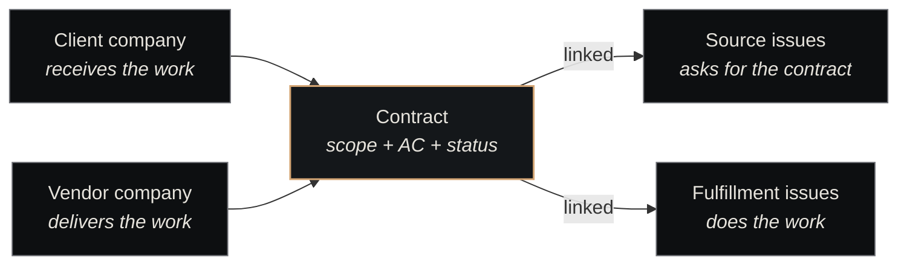

# Contracts

<p class="lede">A contract in Nexus is a <strong>first-class agreement between two companies</strong> — a client and a vendor, with scope, acceptance criteria, a status lifecycle, and an optional negotiation backend for external counterparties. It's what makes "company A asked company B to do X" a queryable, auditable obligation instead of a Slack message and a dispatched ticket.</p>

<div class="page-meta">
  <span class="badge"><span class="dot"></span> living document</span>
  <span>Updated 2026-05-20</span>
  <span>Owner: Platform</span>
</div>

## Why contracts had to become first-class

Before contracts existed as a primitive, cross-company dependencies in Nexus lived implicitly. A domain company like Lighthouse would call `craft_dispatch_ticket` (the [Craft Dispatch plugin](../components/plugins/craft-dispatch.md)) to ask Nexus Engineering for some work. The relationship between the asking ticket and the doing ticket survived as two database columns on the dispatched ticket: `origin_kind` and `origin_id`.

That was enough for *linkage* — you could trace a dispatched ticket back to its source. It was not enough for *obligation*. Three pressures forced the upgrade:

| Pressure | What it surfaced |
|---|---|
| **External work** | Craft companies serving paying customers need scope, terms, deadlines, and a negotiation history. None of that fits in an issue's description field. |
| **Training-data flywheel** | Aurelius's reconstruction + simulator tracks require a schema for "two-company agreement with evolving terms" — the schema has to exist before the tracks can build against it. |
| **Measurement coherence** | "How much work did Nexus Engineering do for Lighthouse last quarter" should be a direct query, not an exercise in reasoning through dispatch chains. |

[ADR-043](decisions-index.md) is the source decision. It defined the schema, the lifecycle, and the contract↔issue relationship.

## The conceptual shape

A contract has a fixed shape regardless of whether it's an internal hand-off or an external paid engagement:



**Two parties, one direction.** Every contract names a client (receives) and a vendor (delivers). The direction is fixed and load-bearing — internal hand-offs have Lighthouse as client + Nexus Engineering as vendor; external engagements would have Nexus Engineering as vendor + some external company as client.

**Issues link, but don't define.** A contract's *existence* is independent of any issue. Issues link in via the `contract_issues` join with one of two roles:

- **Source** — the ticket(s) in the client company that asked for the contract
- **Fulfillment** — the ticket(s) in the vendor company doing the work

A `draft` contract has zero fulfillment issues. A contract is `fulfilled` when *both* every fulfillment issue is `done` *and* every acceptance criterion is verified.

## Internal vs external contracts

Same primitive, two paths through it.

| | Internal | External |
|---|---|---|
| **Both parties** | Companies in the same Nexus instance | One internal company + one external company |
| **Lifecycle** | `draft → active → fulfilled` (skips negotiating) | `draft → negotiating → active → fulfilled` |
| **`negotiation_backend`** | `none` | `aurelius` (today; pluggable for future backends) |
| **Terms** | `terms` is null — internal contracts don't need a redlined document | `terms` is a structured jsonb mirroring the backend's clause structure |
| **Authorisation** | Chairman or agent with the contracts plugin enabled | Chairman + backend handshake |

The `negotiation_backend` field is the extension point. ADR-044 (forthcoming) will define how Aurelius plugs in for external negotiations. Future backends — different legal counsel platforms, escrow services — can extend the enum without changing the contracts primitive itself.

## The lifecycle

Five states, with backend-driven transitions in the middle:


| State | What it means |
|---|---|
| `draft` | Scope defined, not yet binding |
| `negotiating` | Terms being worked out by the external backend |
| `active` | Both sides committed; fulfillment issues can be linked |
| `fulfilled` | All acceptance criteria verified — automatic transition |
| `terminated` | Cancelled; terminal |

The fulfilment transition (`active → fulfilled`) is *derived*, not declared. There's no separate "mark fulfilled" action — when the last unverified acceptance criterion flips, the substrate auto-transitions the contract.

## Acceptance criteria — structured, not narrative

A common failure mode of informal agreements is "done is fuzzy." Contracts force the opposite: each acceptance criterion has a stable ID, lives in a structured array, and can be individually verified:

```json
{
  "acceptance_criteria": [
    { "id": "ac-1", "text": "API exposes /v1/contracts CRUD endpoints", "verified_at": "2026-05-12T14:22:00Z" },
    { "id": "ac-2", "text": "End-to-end test covers create + verify flow",  "verified_at": null },
    { "id": "ac-3", "text": "Metrics emit on every state transition",         "verified_at": null }
  ]
}
```

Why structured matters in practice:
- **Auto-fulfillment** — derived state needs verifiable atoms; you can't auto-flip from a free-text acceptance section
- **Progress visibility** — Cockpit and chairman queries can show "this contract is 1/3 verified"
- **Audit trail** — `verified_at` timestamps survive amendments and contract terminations

A contract with vague acceptance criteria isn't a contract — it's a Slack message in a fancier datatype.

## Amendments, not version bumps

Contracts can change after they go active without losing history. The mechanism is *parent-link*, not *in-place edit*: an amendment is a *new contract row* with `parent_contract_id` pointing at its predecessor. Both stay queryable; the timeline is preserved.

| Action | What happens |
|---|---|
| Amend an active contract | Create new contract row, set `parent_contract_id`, the old contract stays at `active` (or transitions to `terminated` if superseded) |
| Look at the history | Walk the `parent_contract_id` chain backwards — every revision is on disk |
| Query "the current version" | The leaf of the chain (no contract with `parent_contract_id = this.id`) |

This is the same pattern as ADR versioning — *never delete, never silently mutate, always link backwards*.

## What contracts are *not*

Three places the temptation to over-load contracts shows up:

| Temptation | Why it's wrong |
|---|---|
| "Use a contract for every cross-company hand-off" | Internal craft-dispatch (a domain asking Nexus Engineering for routine work) is fine without one. Use contracts when the agreement has *terms* — scope, deadline, fulfilment criteria worth tracking formally. |
| "Contracts execute work" | They don't. Issues execute work. A contract is the agreement; the work is in the linked fulfillment issues. |
| "Mark a contract fulfilled manually" | Don't. Verify acceptance criteria — the substrate flips the status automatically. Manual flips defeat the audit trail. |

The implementation is in the [Contracts plugin](../components/plugins/contracts.md); the lifecycle DFA is DFA 24 in `docs/state-machines.md`.

## How contracts compose with the rest of the substrate

| Adjacent concept | Relationship |
|---|---|
| [Two-class companies](two-class-companies.md) | Contracts formalise the cross-class interface that craft-dispatch implements informally |
| [Tickets](tickets.md) | Source and fulfillment issues are tickets; the contract holds the obligation that links them |
| [Postmortems](postmortems.md) | A failed contract (terminated for non-delivery) is a postmortem-worthy event |
| [Governance](../architecture/governance.md) | Contracts live in the governance layer's auditable-decisions surface |
| [Decisions Index](decisions-index.md) | Major contracts (especially external ones) get accompanying ADRs |

## See also

- [Decisions Index](decisions-index.md) — ADR-043 (the source decision); ADR-044 (Aurelius backend, forthcoming)
- [Contracts plugin](../components/plugins/contracts.md) — the implementation (data model, 5 tools, metrics)
- [Two-class companies](two-class-companies.md) — the company-class split contracts span
- [Craft Dispatch plugin](../components/plugins/craft-dispatch.md) — the *informal* sibling of this primitive
- [Tickets](tickets.md) — what gets linked as source and fulfillment
