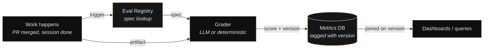

# Evals

An eval is a <strong>versioned scoring rubric</strong> — a structured way to turn "did this piece of work look good?" into a recorded data point with a stable, comparable score. Evals are how the substrate measures itself: every PR, every review, every agent session produces tagged numbers in the metrics DB, queryable over time.

   living document
  Updated 2026-05-20
  Owner: Platform

## Why evals exist

Without evals, "the agent is getting better / worse" is a vibe, not a fact. With evals, it's a query against tagged historical data. Three failure modes evals exist to prevent:

1. **Regression by drift** — small prompt tweaks accumulate into a meaningfully-worse agent without anyone noticing
2. **Improvement by anecdote** — someone changes a prompt because it "felt better on one example"; no evidence it generalised
3. **Untrackable scope** — "is review quality dropping?" can only be answered if review quality was scored consistently before *and* after

Evals turn each of these from "we'll know when it breaks badly" into "we'll know when the trend shifts."

## What an eval *is*

Mechanically, an eval is two files in the [Eval Registry](../components/eval-registry.md):

| File | Format | Purpose |
|---|---|---|
| `specs/<type>/v<semver>.yaml` | YAML | The formal scoring spec — components, weights, thresholds, aggregation rule |
| `rubrics/<type>.md` | Markdown | The human-readable scoring guide — examples, edge cases, what each score level means |

The spec is what the *grader* (LLM or deterministic) consumes. The rubric is what *humans* consult when something looks wrong or when designing a new eval version.

The five types currently live (per the registry's `specs/` directory):

| Eval type | Scores |
|---|---|
| `code-quality` | Test coverage, lint passes, type-check, complexity, naming |
| `security-scan` | Secret presence, dependency CVEs, dangerous-pattern matches |
| `design-adherence` | Design-token usage, accessibility compliance, layout consistency |
| `review-efficiency` | Time-to-verdict, verdict-vs-eval agreement, escalation rate |
| `run-quality` | End-to-end session quality — adherence to AC, transcript hygiene, agent behaviour signals |

Each one operates on a different *unit of measurement* — code-quality scores a PR, review-efficiency scores a review verdict, run-quality scores a full agent session.

## The four grading modes

Eval components fall into one of four grading modes, declared explicitly in the spec:

| Mode | Producer | Example |
|---|---|---|
| `deterministic` | A shell command or test runner | "`pytest --cov` returns ≥ 70%" |
| `boolean` | A binary check | "type-check passes" |
| `llm-graded` | An LLM call against the rubric | "naming quality" — fed the diff, returns a score |
| `weighted-rubric` (composite) | Sum-of-weighted-components | The eval itself, aggregating the above |

The deterministic + boolean modes are cheap, fast, and unambiguous. LLM-graded components carry rubric guidance + examples to keep scores comparable over time. Composite is how the five eval types combine their components into a single score.

## The cardinal rule: tag, don't migrate

This is the rule that makes long-term comparability possible:

> Old scores keep their old version tag. Never retroactively rescore historical data.

If you tighten `code-quality`'s complexity threshold from 12 to 10, you bump to a major version. Scores from before the bump stay tagged `code-quality@3.x`. New scores carry `code-quality@4.0`. A trend chart spanning the cutover joins on `(eval_id, eval_version)`, and a regression analysis that ignored versioning would conflate "the agent got worse" with "the eval got stricter."

Three concrete benefits:

1. **Apples-to-apples comparisons survive** within a major version window
2. **Major-version migrations are explicit** — the `analysis/migration-notes/` directory carries the calibration data so trend dashboards can normalise across the cutover
3. **Bad-eval rollback works** — a major version that turned out to over-penalise can be reverted; the old scores didn't get touched

## Versioning rules (PR-gated)

Evals are versioned more strictly than agents or routines because scores have to remain comparable:

| Bump | What it signals | Required evidence |
|---|---|---|
| **Patch** (`x.y.Z`) | Clarifying language in the rubric, no scoring change | Run the old corpus through the new spec — scores must match |
| **Minor** (`x.Y.0`) | Additive (new component with weight 0, or non-breaking expansion) | KPI evidence: average score moves by < 0.05 on the existing corpus |
| **Major** (`X.0.0`) | Breaking (weight changes, threshold changes, aggregation change) | KPI evidence required; old scores NOT re-graded; migration note added |

A reviewer cannot approve a minor or major bump without evidence in `changelog.md`. The eval registry is the substrate's tightest review gate by design — measurement loses its meaning if measurement itself drifts silently.

## The scoring flow

Every gradeable event triggers the same pipeline:

The metrics DB records `(eval_id, eval_version, score, evidence, timestamp, target_id)` for every grading event. The `target_id` is whatever was scored — a PR ID, a session ID, a review verdict. The `evidence` is the raw materials the grader used (a JSON blob) so a re-grading or audit can recompute the same score.

## The connection to postmortems

Postmortems and evals form a *learning loop* — postmortems surface missing evals, new evals catch the next instance of the failure.

The gap-scan step of [the postmortem pipeline](postmortems.md) keyword-matches the root cause against eval dimensions. If a failure's root cause is "type error" and no `code-quality/type-safety` component exists with sufficient coverage, that's a *named gap* — captured in the `eval_gap_identified` field, surfaced as a follow-up Paperclip ticket.

Without the eval registry, postmortems just describe failures. With it, postmortems *propose new measurements*.

## Who maintains the registry

The `self-improvement` domain company (see [Two-class companies](two-class-companies.md)) owns the eval registry. Its Eval Architect agent reviews PRs against the registry — no direct commits to main, every change is a PR with KPI evidence.

This is deliberate: the substrate that does the work isn't the substrate that scores the work. Self-improvement reads from the metrics DB, identifies patterns, proposes eval changes; the other domain companies don't get to modify their own grading criteria. The split keeps the measurement layer credible.

## What's NOT an eval

Two adjacent concepts that look like evals but aren't:

| Looks like an eval | What it actually is |
|---|---|
| A unit test (`assert add(2,2) == 4`) | A *correctness check*, not a quality score. Tests are pass/fail; evals are graded. |
| A review verdict (`approve` / `reject` / `escalate`) | A *decision*, not a measurement. Verdicts trigger actions; evals inform decisions but don't replace them. |

Evals sit *between* tests (which are categorical) and judgment (which is opaque) — they produce comparable numbers from work that doesn't have a single correct answer.

## When to propose a new eval

Three common triggers, in order of frequency:

1. **A postmortem gap-scan named one** — this is the canonical path; the gap is already documented
2. **A new domain emerges** that the existing 5 types don't cover (e.g. someone proposes `voice-tone` for content work)
3. **An existing eval is regressing on its own measurement quality** — the grader's verdict-vs-eval agreement is dropping, suggesting the rubric needs sharpening

The bar isn't "this would be nice to measure" — it's "without this, the substrate is silently regressing in a way we can't see." Evals have a maintenance cost (the grader runs every relevant event, forever); only the load-bearing ones pay for themselves.

## See also

- [Eval Registry](../components/eval-registry.md) — the implementation (specs, rubrics, comparability matrices)
- [Postmortems](postmortems.md) — the failure-driven path to new evals
- [Governance](../architecture/governance.md) — the architectural layer evals belong to
- [Two-class companies](two-class-companies.md) — `self-improvement` is the domain company that owns the registry
- [Decisions Index](decisions-index.md) — major eval-design ADRs live in the same stream
