# Execution Guardrails

Autonomous execution is allowed to fail — it is not allowed to compound. Nexus layers five independent brakes between an agent that wants to run and a loop that never stops, so any single failure (or any single missed guard) is survivable.

   battle-tested
  Updated 2026-07-08
  Owner: Platform

## Why this exists

The failure mode that matters in agent platforms is not the bad merge — the verify gate catches that — it is the **tight unattended loop**: a ticket that re-spawns a session every cycle, forever, doing nothing useful and spending real money. Nexus has now seen this class twice in production:

- A completed ticket whose stale state kept re-dispatching work (2026-06-04),
- A *novel variant* on the first unsupervised night (2026-06-09): the host's run-cancellation machinery queued retry wakes **and regressed the completed ticket's status**, so every cancellation fed the next attempt. Twenty runs were created and killed in fifteen minutes — and zero of them executed, because the brakes held. But a human still had to step in and freeze the company — the guards were pedalling, not braking.
- The same loop shape on the day execution resumed (2026-07-08) — and this time **nobody stepped in**: five guard cancels inside the window tripped the new escalation ladder, the company quarantined itself, and every run that leaked past the pause was refused. Contained at 5 cancels instead of 20, with no human involved. The same evening, a real ticket traversed the full pipeline — implement → branch → review → verified merge → registry — autonomously in four minutes.

The second incident proved the brakes hold; the third proved the system now *acts on its own recurrence signal*.

## The five layers

```mermaid
flowchart TB
    E[Spawn attempt<br/>webhook · heartbeat · tool · native run] --> L1
    L1{1 · Finished-work check<br/>merged registry → terminal status} -->|finished| X1[refused / cancelled]
    L1 -->|open| L2{2 · Dedup & cooldown<br/>same-kind session live?<br/>spawned too recently?}
    L2 -->|duplicate| X2[refused]
    L2 --> L3{3 · Circuit breaker<br/>recent failures for this company?}
    L3 -->|open| X3[refused]
    L3 --> L4{4 · Volume caps<br/>durable daily counters<br/>per company · per ticket}
    L4 -->|over budget| X4[refused / cancelled]
    L4 --> RUN[Session runs]
    RUN --> V{5 · Verify gate<br/>tests at merge HEAD}
    V -->|pass| M[merged · recorded in registry]
    V -->|fail| R[merge undone<br/>ticket rolled back]
    M -.->|registry feeds layer 1| L1

    style X1 fill:#14171A,stroke:#6F7177
    style X2 fill:#14171A,stroke:#6F7177
    style X3 fill:#14171A,stroke:#6F7177
    style X4 fill:#14171A,stroke:#6F7177
    style M fill:#D4A574,stroke:#D4A574,color:#0D0F11
```

**1 — Finished work never runs again.** Every spawn path re-checks the ticket *at spawn time* (not event time — stale events are exactly the problem). Two sources of truth, in order: the **merged registry**, a platform-owned table the merge-agent writes at merge time, and the ticket's terminal status. The registry exists because status alone proved falsifiable — the 2026-06-09 incident showed the host regressing a `done` ticket to `todo`. A registry row never flaps.

**2 — Dedup and cooldown.** One live session per (ticket, kind); a per-ticket cooldown stops tight re-spawn races. Dispatch dedup is *permanent*: a human cancelling a dispatched ticket is a veto, not an invitation to re-dispatch.

**3 — Circuit breaker.** Repeated spawn failures for a company open its circuit; further spawns are refused until the cooldown lapses.

**4 — Volume caps.** Daily budgets per company and per ticket, stored durably in Postgres so they survive restarts and are shared by **every** execution path — webhook-spawned sessions and host-native runs draw down the same budget. Native runs the host starts before any guard can refuse are *counted then cancelled* within seconds. Concurrency caps bound how much runs at once; volume caps bound how much runs **per day** — the 2026-06-04 incident ran one session at a time, forever, and only a volume cap stops that shape.

**5 — The verify gate.** Completion claims are agent-attested; merges are not. The merge-agent runs the ticket's test command (or one discovered from the repo's shape — chaining the repo's linter ahead of the tests when one is configured, which catches the shadowed-test class the test runner itself is silent on) *at the merge HEAD* before the merge stands. Tests fail → merge undone, ticket rolled back to review. No test available → the merge proceeds but is loudly flagged and counted — never silent. Successful merges are recorded in the registry, which feeds layer 1: the system's definition of "finished" is *verified and merged*, not "an agent said so."

## The escalation ladder

The layers above act per event — each offending spawn is individually refused or cancelled. The 2026-06-09 incident exposed the gap in that design: on some hosts, **a cancellation is itself a trigger** (it queues a retry, it can regress a ticket's status), so a guard that only cancels converts one runaway into an endless cancel/retry ping-pong. It contains the damage but never ends the loop.

The ladder is the answer: when guard cancels for one company cross a threshold within a window (default: 5 in 30 minutes), the company is **auto-quarantined** for the rest of the UTC day —

1. the quarantine flag is set *first* (in-memory **and** durable, so a mid-incident restart cannot forget it),
2. the company's agents are paused *second*,
3. only then does the triggering cancel proceed — **pause-before-cancel**, so the cancel's retry wake lands on paused agents and dies harmlessly,
4. and an escalation comment is posted for the human last (after pausing, so the comment's own wake also dies).

Pause alone is deliberately not trusted as the stop — paused state does not reliably reach every spawn path on the host — so the flag is the brake: every platform path refuses a quarantined company outright, and any run that leaks past the pause is cancelled unconditionally. Un-quarantine is a human decision or the next UTC day, whichever comes first; a still-looping company re-trips the threshold within minutes of the new day, which is itself a loud signal.

The design rule this encodes: **a guard that fires once prevented a bug; a guard that fires N times in a window is *inside* a feedback loop, and its next action must be to step outside the loop — freeze the company — not to keep firing.** Guards must never feed the loop they guard.

## The posture rules

Three rules sit above the layers:

- **OFF is the default.** Execution is enabled deliberately, per company, for a bounded window. Paused agents refuse runs outright — pausing every agent is a hard stop that needs no plugin at all.
- **One call kills everything.** Disable the execution plugin and pause agents: in-flight native runs cancel gracefully; nothing new starts.
- **Recurrence is a signal, not noise.** Every refusal increments a metric. A guard that fires once prevented a bug; a guard that fires twenty times in fifteen minutes *is finding you a design flaw* — that is how the 2026-06-09 loop class was discovered, diagnosed, and fixed the same evening. Since 2026-07-08 the system acts on that signal itself: recurrence past the threshold triggers the escalation ladder without waiting for a human to read the metric.

## What this is not

The guardrails do not make agents smarter or work better-scoped — that is the [ticket contract](tickets.md) and [goal-aware coordination](goal-aware-coordination.md). They make the *worst case boundable*: with every layer live, the maximum cost of any runaway is a day's volume budget of cancelled-at-start runs, and the maximum damage to the codebase is zero, because nothing unverified merges.

## See also

- [Decisions Index](decisions-index.md) — ADR-048 (guardrails), ADR-049 (native execution path conditions), ADR-038 §5 (the verify gate)
- [Tickets](tickets.md) — the five-section contract these guards assume
- [Heartbeat](heartbeat.md) — the scheduler the caps constrain
- [Postmortems](postmortems.md) — where guard recurrence signals become fixes
