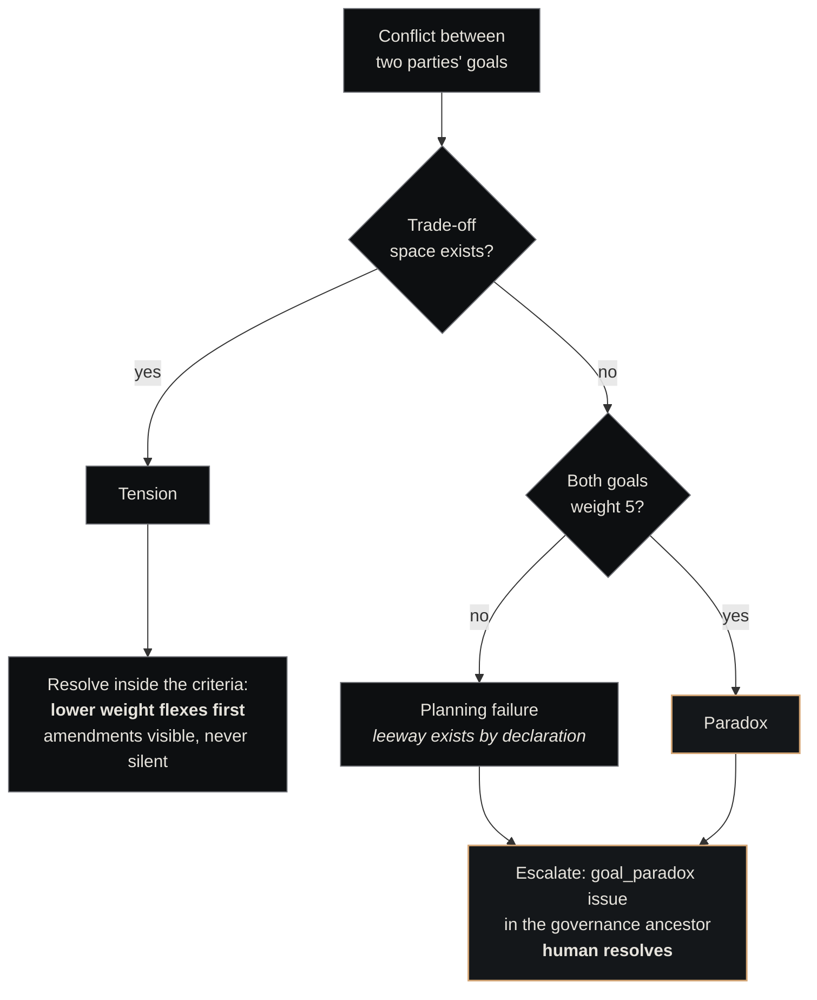

# Goal-Aware Coordination

<p class="lede">When two companies work under a contract, each plans with the <strong>other's objectives in view</strong>. Goals carry weights — a primitive rubric for where leeway lives — so agents know which goal flexes first in a tension, and genuine paradoxes escalate to a human instead of looping forever.</p>

<div class="page-meta">
  <span class="badge"><span class="dot"></span> living document</span>
  <span>Updated 2026-06-04</span>
  <span>Owner: Platform</span>
</div>

## The failure mode this kills

Two companies bound by a [contract](contracts.md) can burn agent cycles **ping-ponging** — optimising the same point in opposite directions. The client iterates the criteria toward *cheaper, sooner*; the vendor iterates the scope toward *sustainable, complete*; each round-trip converges nowhere, because neither party's planning context contains the other's objectives.

The fix is deliberately not negotiation. There are no offers, counteroffers, or bargaining rounds. The mechanism is **mutual awareness**: before acting under a contract, an agent reads *both* parties' goals and plans within both sets. The missing ingredient was information, not bargaining machinery.

!!! note "Source decision"
    [ADR-047](decisions-index.md) is the source decision: goals as the unit of awareness, the weight rubric, the tension/paradox typology, and the human escalation path.

## Goals join the company definition

A company is created *for a reason* — and that reason is its first goal. Canonical provisioning derives every new company's goals from the spec that justified it, completing the provenance thread:

```
spec → class → agents-with-mandate → first project → weighted goals
```

A spec may declare several weighted goals per company; absent that, provisioning creates a single **primary goal at weight 5** — the company's reason to exist is, by definition, non-negotiable. Goals live in the platform's native goals table; their weights live in a small register alongside it (the same pattern as the [class register](two-class-companies.md#where-class-lives)).

Goals change only by their **owning company**. No agent may ever modify a counterparty's goals.

## The weight rubric

Every company-level goal carries an ordinal weight — a ranking of what that company yields first, *not* a utility function:

| Weight | Meaning |
|---|---|
| **5 — inviolable** | The company's reason to exist; never traded away. Challenging it is paradox territory. |
| **4 — firm** | Yields only for a counterparty's weight-5 goal, and only via a visible amendment. |
| **3 — balanced** | Normal trade-off material. |
| **2 — flexible** | The company prefers it but will concede it readily. |
| **1 — nice-to-have** | First thing offered as leeway. |

Weights are **ordinal within one company's goal set**. There is no cross-party arithmetic — a counterparty's 4 cannot be "bought" with two of your 2s. Every weight carries a one-line **rationale**, which is what makes the rubric auditable rather than arbitrary.

**Who sets a weight — the tiered rule.** Initial weights come from the spec, which is already human-gated at proposal review. After that, interior revisions (2 ↔ 3 ↔ 4) are the owning company's to make autonomously; any change **to or from 1 or 5** requires approval from the governance ancestor. That structurally closes weight inflation: no agent can self-promote a goal to inviolable.

## Contracts bind goals

A contract records *which goals it serves on each side* — goal references stored in its terms, validated so a contract can only bind goals its parties actually own. The acceptance criteria gain a sharper meaning under this model: they are the **agreed equilibrium**, the concrete point where both parties' objectives were balanced at signing — a recorded settlement between two goal sets, not just a checklist.

Weights are never copied into the contract. They are read live at planning time, so a company recalibrating its weights is immediately visible to every counterparty.

## The planning protocol: read before you act

Before an agent files, accepts, amends, or re-scopes work under a contract, it calls one tool:

```text
get_coordination_context(contract_id)
  → { contract (incl. acceptance criteria),
      client_goals[],   # each: title, weight, rationale
      vendor_goals[] }  # weights joined live from the register
```

The agent plans **within both goal sets**. That is the entire mechanism — no messages exchanged, no rounds, no protocol beyond *look before you optimise*. Only the two parties (or the chairman) may read a contract's coordination context.

## Tension vs paradox

The load-bearing distinction, made crisp by the weights:



**Tension** — same dimension, opposite preferences, but a trade-off space exists (cost vs completeness, speed vs durability). Agents resolve it inside the acceptance criteria, guided by the rubric: the lower-weighted goal flexes first. If the criteria no longer fit, either party proposes an **amendment** — a visible, logged contract event — never a silent re-scope.

**Paradox** — satisfying one party's goal logically violates the other's, with no trade-off space. The canonical form is two weight-5 goals in direct conflict: neither side is *permitted* to yield, so no agent resolution can be legitimate. **No agent resolution permitted** — escalate to a human.

Conversely, any conflict involving a sub-5 goal is presumptively a tension: leeway exists *by declaration*, so an agent claiming deadlock there is failing the protocol, not facing a paradox. That stalemate also escalates — tagged as a planning failure.

Worked example: Lighthouse (client) holds *"surface compliance gaps quickly"* at weight 3 and *"minimise audit cost"* at weight 2; Nexus Engineering (vendor) holds *"deliver maintainable tooling"* at weight 4. When speed pressure collides with maintainability, the rubric gives a deterministic first move — Lighthouse's weight-2 cost goal flexes before anything else, and Engineering's weight-4 goal yields only to a weight-5, via amendment.

## Escalation and the refinement loop

A paradox becomes an **issue in the lowest common governance ancestor** of the two companies (found via the class register's lineage), tagged `goal_paradox`, carrying both goal IDs, the contract ID, and a one-paragraph statement of the incompatibility. Resolution authority is the same designated human role that approves [company spawns](../components/plugins/agora.md). Outcomes: amend a goal (by its owner), amend the contract, or terminate it. The issue is the audit record.

Every extreme weight revision is *also* a review trigger — the question is not only "may this weight move?" but "**why does it need to?**" Because extreme revisions and paradox escalations arrive as issues, every goal accumulates a friction history for free, and recurrence is the signal:

- A goal that **oscillates** (repeated extreme revisions) is doing two jobs, or its declared priority disagrees with its real one.
- A goal that keeps producing **paradoxes** needs its boundary redrawn, not another arbitration.

In both cases the prescription is **refinement, not another revision**: governance prompts the owning company to split, reword, or re-scope the goal, with the history as evidence. It's the [postmortem](postmortems.md) discipline applied to objectives — recurring friction is a signal about the artifact, not the incident.

## What this is explicitly not

- **Not negotiation.** No offers, counteroffers, or concession schedules. Awareness, then planning.
- **Not utility functions.** Weights are an ordinal yield-first ranking — no summing, multiplying, or trading across companies.
- **Not a central planner.** Companies remain autonomous peers; nothing above them computes a global optimum.
- **Not goal arbitration by agents.** Humans own all paradox resolutions.

## See also

- [Contracts](contracts.md) — the agreement primitive whose terms bind the goals
- [Company classes](two-class-companies.md) — the lineage that locates the governance ancestor
- [Governance layer](../architecture/governance.md) — where escalations land and who resolves them
- [Contracts plugin](../components/plugins/contracts.md) — `get_coordination_context` and the `goals` parameter
- [Agora plugin](../components/plugins/agora.md) — delegation contracts arrive goal-bound
- [Decisions index](decisions-index.md) — ADR-047
