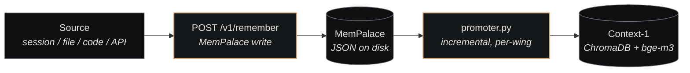

# Ingestion

<p class="lede">Ingestion is how content from <em>any source</em> — a Claude Code session, an auto-memory note, a project doc, source code, a diary entry, an external artifact — lands in <a href="../components/nexus-memory.md">Nexus Memory</a>. Every source funnels through the same write path, with the same dedup guarantees and the same promoter mirror to Context-1. This page is the source-by-source map.</p>

<div class="page-meta">
  <span class="badge"><span class="dot"></span> living document</span>
  <span>Updated 2026-05-20</span>
  <span>Owner: Platform</span>
</div>

## The shared shape

Every ingest path — regardless of source — does the same three things:



| Stage | What happens | Embedder |
|---|---|---|
| **Write to MemPalace** | `POST /v1/remember` with `(content, wing, room, source_file?, source_type?)` | chromadb default (`all-MiniLM-L6-v2`, CPU) for MP-internal lookup |
| **Content-hash dedup** | Identical content in the same `(wing, room)` is a no-op upsert | n/a |
| **Promoter mirror** | The `promoter.py` script (cron + on-demand) re-embeds missing drawers into Context-1 | **bge-m3 on GPU** |

The split between MemPalace and Context-1 is deliberate — MP is the authoritative *source of truth* (JSON on disk, content-addressed), while C1 is the *retrieval surface* (vectorised, agentic-retrieval-ready). The promoter is the bridge.

## The six ingest sources

| Source | Trigger | Wing | Room | Source-type tag |
|---|---|---|---|---|
| **Sessions** | Claude Code `Stop` hook | `claude` or `<project>` | `sessions` | `session` |
| **Memory files** | Auto-memory `.md` write | matches the project's wing | `memory_files` | `memory_file` |
| **Project docs** | `index_aurelius.py` / project ingest scripts | `<project>` | `documentation`, `plan_docs`, `analysis` (varies) | `project_doc` |
| **Code** | Source-tree indexer | `<project>` | `code` | `code` |
| **Diary** | `mempalace_diary_write` MCP tool | `claude` | `diary` | `diary` |
| **External** | Any agent calling `memory_remember` or hitting `/v1/remember` directly | caller's choice | caller's choice | caller's choice |

The `source_type` tag is what makes per-source filtering possible. Without it, "show me only session transcripts in the nexus wing" would require parsing source file paths; with it, the query is a single metadata filter.

## Source 1: Sessions

The canonical case — every Claude Code session produces a `.jsonl` transcript that gets captured.

**Trigger**: `~/.claude/settings.json` `Stop` hook runs `~/.dotfiles/claude/scripts/memory_ingest.py --latest-session` when the session ends.

**What the script does**:

1. Health-probes MemPalace (`/v1/status`)
2. Finds the most-recent `.jsonl` transcript under `~/.claude/projects/`
3. Extracts the session's `cwd` and `gitBranch` from the first user/assistant record
4. Routes to a wing based on cwd — `claude` for human sessions, `<project>` for project-cwd sessions (e.g. `nexus`, `aurelius`)
5. `POST /v1/remember` with `source_type: "session"` and the transcript as content
6. Fires `_fire_promoter_async` to kick the per-wing promoter

**Wing routing rule**: the script's `route_session_to_wing()` function maps cwd patterns to wings. The default mapping puts everything under `claude`; project-specific overrides go in the script's `WING_ROUTES` dict.

## Source 2: Memory files

Auto-memory `.md` notes (the kind Claude Code writes via the `auto memory` system) land in MemPalace via a separate path.

**Trigger**: Hook on `.md` file write under `~/.claude/projects/*/memory/`. Every time auto-memory writes a new note (e.g. `feedback_dual_pipeline.md`), the file is ingested as a separate drawer.

**Wing routing**: derived from the project directory the memory belongs to — a memory file under `nexus-integration` ingests into the `nexus` wing under room `memory_files`.

**Why a separate path**: memory files are *much smaller* than session transcripts (typically <1 KB vs. session transcripts at hundreds of KB), and they need finer-grained ingest so each note becomes its own searchable atom. Bundling them into the session transcript would conflate one drawer with many discrete notes.

## Source 3: Project docs

Long-form documentation, plan files, ADRs, design docs — everything in `docs/` directories that an agent might want to retrieve later.

**Trigger**: project-specific ingest scripts. The Nexus and Aurelius codebases each have an `index_<project>.py` script (`nexus-memory/scripts/index_aurelius.py` is the live exemplar) that:

1. Walks the project's doc tree
2. For each `.md` / `.txt` / `.pdf`, computes a stable `source_file` hash
3. `POST /v1/remember` with content + room derived from the file's location

**Room derivation**: by directory:

| File path under project | Room |
|---|---|
| `docs/decisions/*.md` | `decisions` |
| `docs/plans/*.md` | `plan_docs` |
| `docs/analysis/*.md` | `analysis` |
| `docs/*.md` (other) | `documentation` |
| Top-level `README.md`, `CLAUDE.md` | `documentation` |

These scripts are designed to be **re-runnable** — content-hash dedup makes a second run a no-op for unchanged files, and a content-changed file gets re-ingested as a new drawer (with the old drawer optionally deleted via the `replace-on-source-file` flag).

## Source 4: Code

Source files themselves can be ingested for semantic code search.

**Trigger**: a code-indexer (currently a one-shot script per project, not a hot watcher) walks the source tree and ingests `.py` / `.ts` / `.go` files.

**Wing/room**: `<project>` / `code`.

**Why ingest code at all**: the code-search use case is *intentional embedding-based search* — "show me where the embedder client is configured" finding the function regardless of filename. For exact-symbol search, ripgrep is still better; for *conceptual* search, embeddings beat it.

Code ingestion is run **infrequently** — the typical refresh cadence is weekly, not per-commit. The cost-benefit tradeoff is bad if the code changes faster than the embedder can keep up.

## Source 5: Diary

Daily reflections by the chairman or by agents themselves go through a dedicated MCP tool, not the file-watch path.

**Trigger**: an agent calling `mempalace_diary_write` (one of the 25 MemPalace MCP tools).

**Why separate**: diary entries have *structure* the bulk write path doesn't enforce — they get tagged with a date, a topic, an actor (chairman vs. agent). The diary tool wraps `POST /v1/remember` with that structure baked in, so retrieval can filter by date range or actor without scanning all session drawers.

**Wing/room**: `claude` / `diary` (for chairman diaries) or `<agent>` / `diary` for agent self-reflection entries.

## Source 6: External

Anything an agent or external service explicitly chooses to remember outside the above paths.

**Trigger**: direct `POST /v1/remember` call (or the `memory_remember` MCP tool from the [memory plugin](../components/plugins/memory.md)).

**Wing/room/source_type**: chosen by the caller. The substrate doesn't enforce a taxonomy — this is the "you know best" escape hatch.

**When to use it**: when an agent encounters a load-bearing fact, decision, or pattern it wants to make findable later, and none of the structured paths above apply. The bar is *"this would help a future session that hasn't been written yet"* — not every fleeting thought.

## Concurrency guarding

The promoter has a known fork-bomb failure mode: each session-end hook can fire a new promoter while the previous one is still running, eventually OOM-ing the host. The fix is a **PID-lockfile guard** in `_fire_promoter_async`:

```python
# scripts/promoter.py - the lock that prevents fork-bomb
lock_path = Path(f"/tmp/promoter-{wing}.lock")
if lock_path.exists():
    pid = int(lock_path.read_text())
    if os.kill(pid, 0):                # 0 = is-it-alive probe
        return                          # previous run still going — skip
    # else: stale lock from a dead PID — overwrite and proceed
```

Result: at most one promoter per wing runs at a time. Queued spawns eventually catch up — content-hash dedup handles re-ingest of any drawer that was already promoted.

## Failure modes the pipeline handles

| Failure | Recovery |
|---|---|
| MemPalace unreachable | `/v1/status` probe fails; ingest aborts; next trigger retries |
| Promoter takes > 1 cycle | Lockfile guard skips concurrent spawns; next free spawn picks up the latest delta |
| Embedder OOM on GPU | Promoter exits with error; next run resumes from where it left off (content-hashed IDs) |
| Stale lockfile (dead PID) | `os.kill(pid, 0)` detects, overwrites, proceeds |
| Session jsonl missing trivia (cwd, branch) | Script falls back to defaults and still ingests |
| Content-changed source file (project docs) | Old drawer replaced if `replace-on-source-file` is set; otherwise new drawer added alongside the old |

The shared pattern: **never lose content**, even when something goes wrong. Failures pause ingestion; they don't drop data.

## See also

- [Memory Protocol](memory-protocol.md) — how to *use* the resulting memory (read side)
- [Wings & Rooms](wings-and-rooms.md) — where ingested content lands in the taxonomy
- [Nexus Memory](../components/nexus-memory.md) — the storage component (MemPalace + Context-1 + promoter)
- [Memory plugin](../components/plugins/memory.md) — agent-facing tools that wrap the REST surface
