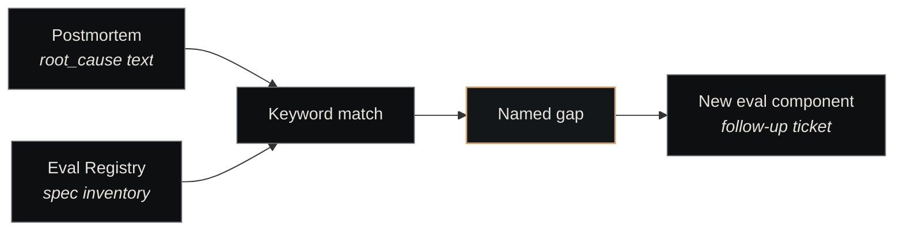

# Postmortems

<p class="lede">A postmortem is the substrate's <strong>structured response to a production failure</strong>: a record of what failed, why, and what changed downstream so the failure mode doesn't recur silently. In Nexus, postmortems are filed as numbered ADRs and produced by a state machine that runs after every ticket execution that ends in error.</p>

<div class="page-meta">
  <span class="badge"><span class="dot"></span> living document</span>
  <span>Updated 2026-05-19</span>
  <span>Owner: Platform</span>
</div>

## Why postmortems exist

Software failures fall into two failure-of-failure-handling categories:

1. **Silent recurrence** — the same failure happens twice because no one knew the first instance happened
2. **Lost reasoning** — the cause was understood once, then the understanding evaporated

Postmortems are the substrate's lever against both. The *record* prevents silent recurrence; the *required sections* (what failed, root cause, eval-gap identified, catalog change triggered) prevent the reasoning from evaporating.

> Every production failure MUST produce a postmortem regardless of severity.

That's the rule in `nexus-core/nexus/execution/postmortem.py`. No "minor failures don't need one" loophole — the pipeline always runs.

## The four required sections

Every postmortem record is a `PostMortem` Pydantic model with four sections:

| Section | What it captures |
|---|---|
| `what_failed` | Concrete description of the failure — drawn from ticket title + error signal |
| `root_cause` | The underlying mechanism — drawn from handoff report or error signal |
| `eval_gap_identified` | Optional — if root-cause keywords match an eval dimension, the missing eval is named here |
| `catalog_change_triggered` | Optional — if a catalog (agent / routine / eval) needs to change as a result, the change is noted |

The first two are *required at record-build time*. The latter two are populated only if the gap-scan + ADR-writing steps surface something. A postmortem with empty `eval_gap_identified` is still a valid postmortem — the gap-scan ran and found nothing actionable.

## The pipeline (DFA 20)

The state machine is canonical in DFA 20 of `docs/state-machines.md`:


Five stages, in order:

1. **`triggered`** — A ticket reaches a terminal error state (Nexus Core detects it during `on_session_complete`).
2. **`building_record`** — Build the `PostMortem` record from ticket metadata + error signals. Enforces the four required sections.
3. **`scanning_eval_gaps`** — Keyword-match the root cause against eval dimensions in the [Eval Registry](../components/eval-registry.md). If matches, name the gap.
4. **`writing_adr`** — Persist the postmortem as a numbered ADR under `docs/decisions/`.
5. **`filing_issue`** — Create a follow-up Paperclip issue (labelled `postmortem`) so the gap or catalog change becomes tracked work.

### Eval-gap keyword matching

The gap-scan is a simple keyword → eval-dimension map. Patterns include:

| Keyword pattern in root cause | Maps to |
|---|---|
| `logic error` | `code-quality/correctness` |
| `type error` | `code-quality/type-safety` |
| `test.*fail` | `test-coverage/regression` |
| `security` | `security-audit/vulnerability` |

When a match fires, `eval_gap_identified` gets populated with the eval type that *would have caught* this failure if it had existed (or been broader). That's the seed for "we need a new eval component" follow-up work.

## Non-fatal at every step

A key design property: **every step is non-fatal**. If ADR writing fails (filesystem error), the pipeline keeps going. If issue creation fails (Paperclip API down), the pipeline still reaches `complete`. The `PostMortem` record tracks which outputs succeeded:

```python
postmortem.adr_entry_path        # None if ADR write failed
postmortem.eval_gap_specs        # [] if gap scan errored
postmortem.paperclip_issue_id    # None if issue creation failed
```

Operators can find half-completed postmortems by querying for records with any `None` in those fields. The substrate's failure analysis can't be blocked by another failure mid-pipeline.

## When postmortems fire

Today: any ticket execution that ends in a terminal error state. Specifically:

- Agent exits non-zero
- Agent times out (idle 30 min, max age 8 hours)
- Agent silent-terminates (exits 0 but posts no verdict)
- Merge agent fails (test gate, conflict, etc.)

The trigger lives in `nexus-core/nexus/execution/`'s `on_session_complete` handler. The handler routes failure outcomes into the postmortem pipeline; success outcomes route into normal ticket state transitions.

## Reading existing postmortems

Postmortems are ADRs with `Status: Postmortem` (and titles starting with `ADR-NN: Post-Mortem`). Two are already in the tree:

- **ADR-031** — production failure on ticket `87b8c9ab-...` (a silent-termination case)
- **ADR-035** — Domain agents stuck in coding-CLI TUI (chat-adapter misconfiguration)

Both appear in the [Decisions Index](decisions-index.md). The pipeline files new ones into the same numbered stream — the next postmortem will take the next free ADR number.

## The connection to evals

Postmortems and the [Eval Registry](../components/eval-registry.md) are tightly coupled. The gap-scan stage is the bridge:



This is the substrate's *learning loop*: failure → record → gap-scan → new eval → future failures of the same kind get caught proactively. The follow-up Paperclip ticket the pipeline files is the work item that closes that loop.

## How to action a postmortem

Walkthrough: [Triage a Postmortem](../guides/triage-a-postmortem.md). The short version:

1. **Read the record** — what failed, what the root cause says
2. **If `eval_gap_identified` is non-empty** — propose a new eval component in the registry (PR-gated change to `eval-registry/specs/<type>/`)
3. **If `catalog_change_triggered` is non-empty** — propose the catalog change (agent prompt, routine schedule, etc.)
4. **Close the follow-up ticket** the pipeline filed once the change is merged

## See also

- [Decisions Index](decisions-index.md) — the ADR catalog that postmortems land in
- [Governance](../architecture/governance.md) — the architectural layer postmortems live within
- [Eval Registry](../components/eval-registry.md) — the canonical scoring surface that gap-scans match against
- [Nexus Core](../components/nexus-core.md) — where the pipeline runs (`nexus/execution/postmortem.py`)
- [Triage a Postmortem](../guides/triage-a-postmortem.md) — operational walkthrough
