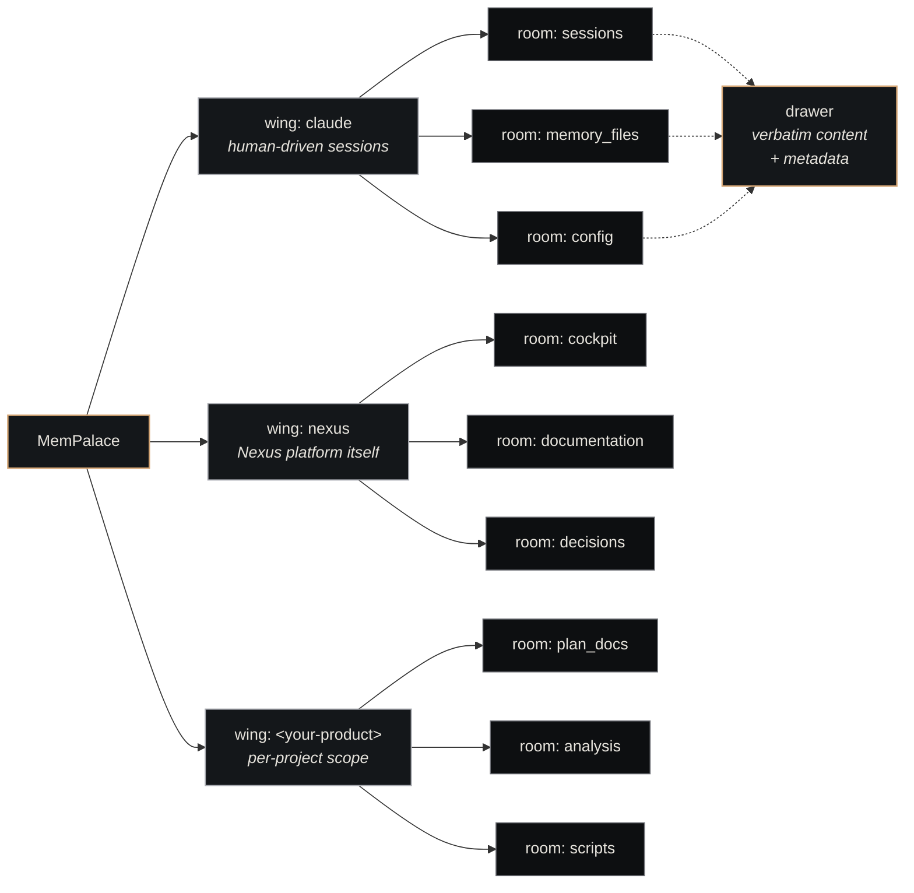

# Wings & Rooms

Nexus Memory uses a two-level taxonomy: **wings** at the top, **rooms** inside each wing. This split keeps content addressable, prevents cross-tenant leakage, and makes search scopable.

## The model



Every memory item — a **drawer** — lives in exactly one `(wing, room)` pair. The taxonomy is intentionally flat at two levels: deeper hierarchy turned out to fragment recall more than it helped retrieval scope.

## Wings

A wing is a **scope of authorship**. Use one wing per:

- Product (e.g., `your-product`)
- Tenant (e.g., `customer-acme`)
- Session source (e.g., `claude` for human-driven sessions, `claude-nexus-agents` for dispatched-agent sessions)

Wings are deliberately coarse. Don't create a new wing per ticket or per file — that goes in rooms.

## Rooms

A room is a **semantic bucket** within a wing. Typical room names:

| Room | What goes in it |
|---|---|
| `sessions` | Full Claude Code session transcripts |
| `memory_files` | Auto-memory `.md` notes |
| `plan_docs` | Planning / design markdown |
| `decisions` | ADRs / decision records |
| `documentation` | User-facing or onboarding docs |
| `scripts` | Code snippets / utility scripts |
| `analysis` | Output of investigations |
| `config` | Configuration files |

Rooms are conventional, not enforced. New rooms are created on first write.

## Why two levels (not one, not three)

- **One level (flat)** loses tenant separation. Hard to query "what does product X know" without metadata filters on every drawer.
- **Three levels** (wing/room/shelf, say) ends up arbitrary — drawers already have rich metadata; another taxonomy level adds friction without information.
- **Two levels** matches how humans actually navigate: "go to the X area, look in the Y bucket." Maps cleanly to faceted search.

## Routing rules

When a drawer is written via `/v1/remember`:

```json
{
  "content": "...",
  "wing": "your-product",
  "room": "plan_docs",
  "source_file": "/path/to/source.md"
}
```

The routing decision is the **writer's** responsibility, not Nexus's. The platform doesn't infer wing/room from content — it stores what the caller specifies.

Convention: agents writing on behalf of a company should use that company's wing. Background ingest paths (e.g., session-end hook) use the wing matching the session source.

## Search semantics

Queries can be scoped at three granularities:

| Scope | Returns |
|---|---|
| All wings | Cross-tenant search. Default. |
| `wing` only | Drawers from that wing across all rooms. |
| `wing` + `room` | Tight scope — single bucket. |

```python
# Whole-MemPalace
GET /v1/retrieve?query=...

# One wing
GET /v1/retrieve?query=...&wing=nexus

# One bucket
GET /v1/retrieve?query=...&wing=nexus&room=decisions
```

## See also

- [Memory Protocol](memory-protocol.md) — when to use which scope
- [Memory Layer](../architecture/memory-layer.md) — where wings/rooms sit in the broader stack
- [Nexus Memory](../components/nexus-memory.md) — implementation details
- [AAAK Encoding](aaak.md) — the compressed format used inside drawer content
