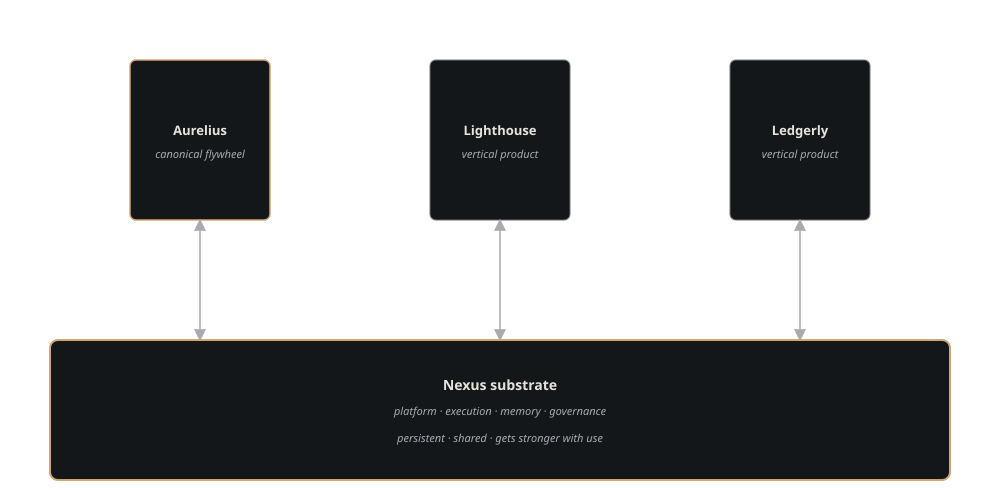

---
hide:
  - navigation
  - toc
---

# Nexus Docs

Nexus is a substrate for running <strong>companies of AI agents</strong>: a control plane that owns the work (companies, tickets, agents), a memory layer that survives every session, and a governance layer — contracts, goals, evals, human gates — that lets the system improve without drifting. These docs are for the people building on top.

   living document
  Updated 2026-05-19
  Owner: Platform

-   01 · Start
    [Quickstart](getting-started/overview.md)

    Install the stack, file a ticket, watch an agent carry it to done.

-   02 · Concepts
    [The control plane](concepts/companies.md)

    Companies own the work, tickets carry it, agents execute it. Start here — every other page assumes these three.

-   03 · Concepts
    [Memory model](concepts/wings-and-rooms.md)

    Wings, rooms, drawers: where knowledge lives, who can see it, and how it finds its way back into a session.

-   04 · Architecture
    [The flywheel](architecture/flywheel.md)

    Why outcomes compound back into the substrate instead of plateauing the way pipelines do.

-   05 · Reference
    [API](reference/api-paperclip.md)

    Every endpoint, parameter, and error — control plane and memory, with curl examples.

-   06 · Internals
    [Execution stack](components/nexus-core.md)

    How a ticket becomes a running agent session: dispatch, heartbeat, and the audit trail it leaves.

## The mental model

The brass-bordered foundation is Nexus. Each column rising from it is a separate vertical product — a flywheel — running on the substrate: services flow up, outcomes flow back down, and every outcome that lands makes the substrate (and the next flywheel built on it) better.

The substrate's primitives are deliberately few: [companies](concepts/companies.md) own backlogs, [tickets](concepts/tickets.md) are the unit of work, [agents](concepts/agents.md) execute them, [contracts](concepts/contracts.md) make cross-company obligations explicit, [goals](concepts/goal-aware-coordination.md) keep both sides of a contract pointed the same way, and the [flywheel](architecture/flywheel.md) compounds the outcomes back in. New companies are born from approved specs through a human-gated [spawn pipeline](components/plugins/agora.md) — the org chart itself is a substrate artifact.
